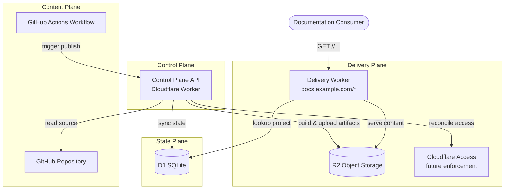

# Design Document — nrdocs Platform

## Overview

nrdocs is a serverless private documentation publishing platform built on a Cloudflare-only stack. It serves documentation minisites from Markdown repositories under a single shared hostname (`docs.example.com/<slug>/`). Each project maps to one repository, uses explicit admin registration, and supports public or password-protected access in phase 1.

The system comprises four logical planes:

- **Content Plane** — Project repositories containing Markdown content, `project.yml`, `nav.yml`, and optional `allowed-list.yml`
- **Control Plane** — Admin API for project registration, lifecycle management, publish orchestration, and Cloudflare reconciliation
- **State Plane** — D1 (SQLite) as the authoritative system of record for project state, access policy, and operational records
- **Delivery Plane** — Cloudflare Worker as a thin request router and auth gate, serving static content from R2

Key design decisions:
- D1 is the primary system of record; repo config expresses desired state, D1 stores effective state
- Phase 1 is Cloudflare-only, but all platform-specific integrations are abstracted behind interfaces for future expansion
- Publishing is triggered by GitHub Actions but the Control Plane is the sole build authority
- Password hashing uses scrypt; session tokens are HMAC-signed opaque tokens (`base64url(payload).base64url(signature)`), not JWT
- R2 uses a staging-only upload model: artifacts are always uploaded to a staging prefix, and the active publish pointer in D1 is updated to point at the staged prefix on success — there is no separate `live/` prefix or copy/promote step

## Architecture



### Request Flow

1. A request arrives at `docs.example.com/<slug>/path`
2. The Delivery Worker extracts the slug from the first path segment
3. The Worker looks up the project in D1 by slug
4. If the project is not found or is `disabled`, the Worker returns HTTP 404
5. If the project is `public`, the Worker resolves the R2 path via the active publish pointer and serves content
6. If the project is `password`-protected, the Worker checks for a valid session token cookie
7. If no valid session exists, the Worker returns the login page
8. On successful password verification, the Worker issues a session token cookie and redirects to the requested path

### Publish Flow

1. GitHub Actions triggers the Control Plane publish endpoint with repo identity and auth credentials
2. The Control Plane validates the project exists and has status `approved`
3. The Control Plane reads repo config and content from the registered repository
4. The Control Plane builds the static site from Markdown content and `nav.yml`
5. Artifacts are uploaded to R2 under a versioned prefix (`publishes/<slug>/<publish_id>/`)
6. On successful upload, the Control Plane atomically updates the active publish pointer in D1 to the new prefix
7. The Control Plane replaces repo-derived access entries in D1 from the current `allowed-list.yml`
8. If access config changed, the Control Plane reconciles Cloudflare Access configuration
9. The Control Plane records the publish outcome as an operational record in D1
10. Orphaned artifacts from previous publish prefixes are cleaned up asynchronously

### URL Resolution

- Trailing-slash paths (e.g., `/<slug>/section/page/`) resolve to `<active_publish_pointer>/section/page/index.html` in R2
- Paths without trailing slash and without file extension receive an HTTP 301 redirect to the trailing-slash form
- Paths with file extensions (`.html`, `.css`, `.js`, etc.) serve the literal R2 object at `<active_publish_pointer>/<remaining_path>`

## Components and Interfaces

### Platform Abstraction Interfaces

All platform-specific integrations are abstracted behind clean interfaces to support future expansion beyond Cloudflare.

#### StorageProvider Interface

```typescript
interface StorageProvider {
  /** Upload a single artifact to a path */
  put(path: string, content: ArrayBuffer, contentType: string): Promise<void>;
  /** Read an artifact by path */
  get(path: string): Promise<{ content: ArrayBuffer; contentType: string } | null>;
  /** Delete a single artifact */
  delete(path: string): Promise<void>;
  /** List objects under a prefix */
  list(prefix: string): Promise<string[]>;
  /** Delete all objects under a prefix */
  deletePrefix(prefix: string): Promise<void>;
}
```

Phase 1 implementation: `R2StorageProvider` backed by Cloudflare R2.

#### DataStore Interface

```typescript
interface DataStore {
  // Project operations
  getProjectBySlug(slug: string): Promise<Project | null>;
  getProjectById(id: string): Promise<Project | null>;
  createProject(project: NewProject): Promise<Project>;
  updateProjectStatus(id: string, status: ProjectStatus): Promise<void>;
  deleteProject(id: string): Promise<void>;
  updateActivePublishPointer(projectId: string, pointer: string): Promise<void>;

  // Access policy operations
  getAccessPolicies(projectId: string): Promise<AccessPolicyEntry[]>;
  getPlatformPolicies(): Promise<AccessPolicyEntry[]>;
  replaceRepoDerivedEntries(projectId: string, entries: AccessPolicyEntry[]): Promise<void>;
  upsertAdminOverride(entry: AccessPolicyEntry): Promise<void>;
  deleteAdminOverride(entryId: string): Promise<void>;

  // Password operations
  // Note: password_hash and password_version are stored on the projects table.
  // These methods are convenience accessors that operate on the project record.
  getPasswordHash(projectId: string): Promise<{ hash: string; version: number } | null>;
  setPasswordHash(projectId: string, hash: string, version: number): Promise<void>;

  // Operational records
  recordEvent(event: OperationalEvent): Promise<void>;
}
```

Phase 1 implementation: `D1DataStore` backed by Cloudflare D1.

#### AccessEnforcementProvider Interface

```typescript
interface AccessEnforcementProvider {
  /** Create or update access policy for a project path */
  reconcileProjectAccess(projectSlug: string, policies: AccessPolicyEntry[]): Promise<void>;
  /** Remove all access configuration for a project path */
  removeProjectAccess(projectSlug: string): Promise<void>;
}
```

Phase 1 implementation: `CloudflareAccessProvider` (for future `invite_list` mode). For `password` mode, the Worker handles auth directly without Cloudflare Access.

### Core Components

#### Delivery Worker

The thin request router and authentication gate. Responsibilities:
- Parse slug from URL path
- Look up project in D1
- Enforce project status (404 for unknown/disabled)
- Serve public content directly from R2
- Handle password auth flow (login page, password verification, session management)
- Set `Cache-Control` headers per platform freshness policy
- Rate-limit login attempts

Project metadata (slug, status, access_mode, active_publish_pointer, password_version) is read from D1 on each request in phase 1. If D1 latency becomes a concern, a short in-memory TTL cache (e.g., 30–60 seconds) per Worker isolate can be introduced without changing the interface. This means a project disable or publish pointer update may take up to one TTL window to propagate, which is acceptable for phase 1.

#### Control Plane API

A separate Cloudflare Worker exposing admin endpoints. Responsibilities:
- Project registration, approval, disable, delete
- Publish orchestration (validate → read repo → build → upload → activate → sync access)
- Admin override CRUD
- API key authentication on all endpoints

API keys are stored as Cloudflare Worker secrets (environment variables bound at deploy time), not in D1. This keeps key material out of the database and leverages Cloudflare's encrypted secret storage. Phase 1 uses a single platform-wide admin API key; future phases may introduce per-admin keys stored in D1 with hashed values.

**Delete transaction semantics:** Deletion proceeds in order: (1) mark project as disabled in D1, (2) delete R2 artifacts via `StorageProvider.deletePrefix`, (3) remove Cloudflare Access configuration, (4) delete the project record and associated D1 state. If R2 cleanup fails after D1 disable, the project is already inaccessible (returns 404) and the failure is logged as a partial deletion requiring manual R2 cleanup. If D1 final deletion fails after R2 cleanup, the project record remains in `disabled` state and the failure is logged. This ensures the project is never served after a delete attempt begins, even if cleanup is incomplete.

#### Site Builder

A module invoked by the Control Plane during publish. Responsibilities:
- Parse `project.yml` and validate slug match
- Parse `nav.yml` and validate page references
- Parse Markdown pages with frontmatter metadata
- Render HTML using the standard template
- Generate navigation markup from `nav.yml`
- Produce the complete artifact set for upload

#### Access Policy Engine

A pure function that evaluates access for a given subject against the layered policy. Evaluation order:
1. Platform blacklist → deny
2. Platform whitelist → allow (all projects)
3. Project blacklist → deny
4. Project whitelist → allow (specific project)
5. Repo-derived allow → allow (specific project)
6. Default → deny

Supports exact email and domain wildcard (`*@example.com`) matching. Only applies to future `invite_list` mode; `password` mode uses password verification, `public` mode skips evaluation entirely.

#### Session Token Manager

Handles creation and validation of HMAC-signed opaque session tokens.

Token format: `base64url(payload).base64url(signature)`

Payload fields:
- `v` — token format version
- `pid` — project ID (always the internal project ID, not the slug, to avoid ambiguity)
- `iat` — issued-at timestamp (seconds)
- `exp` — expiry timestamp (seconds)
- `pv` — password version identifier

Operations:
- `create(projectId, passwordVersion, signingKey, ttl)` → token string
- `validate(token, signingKey, currentPasswordVersion)` → `{ valid, projectId }` or rejection reason

#### Password Hasher

Wraps scrypt hashing and verification:
- `hash(plaintext)` → scrypt hash string
- `verify(plaintext, storedHash)` → boolean

### Rate Limiter

Tracks failed login attempts per project within a configurable time window. After exceeding the threshold, returns HTTP 429 for subsequent attempts until the window expires.

Phase 1 keys rate limiting by `project_id` only, not by client IP. This means a single attacker could trigger the rate limit for all users of that project. This tradeoff is accepted for MVP simplicity — the window is short and the lockout is temporary. A future iteration may add per-IP or per-IP+project keying to reduce collateral lockout risk.

## Data Models

### D1 Schema

#### `projects` Table

| Column | Type | Constraints | Description |
|--------|------|-------------|-------------|
| `id` | TEXT | PRIMARY KEY | UUID, assigned at registration |
| `slug` | TEXT | UNIQUE, NOT NULL | Immutable URL path segment |
| `repo_url` | TEXT | NOT NULL | Canonical repository identifier |
| `title` | TEXT | NOT NULL | Project display title |
| `description` | TEXT | | Project description |
| `status` | TEXT | NOT NULL | `awaiting_approval`, `approved`, `disabled` |
| `access_mode` | TEXT | NOT NULL | `public`, `password` |
| `active_publish_pointer` | TEXT | | R2 prefix for current live artifacts |
| `password_hash` | TEXT | | scrypt hash, nullable (only for password mode) |
| `password_version` | INTEGER | NOT NULL DEFAULT 0 | Incremented on each password change |
| `created_at` | TEXT | NOT NULL | ISO 8601 timestamp |
| `updated_at` | TEXT | NOT NULL | ISO 8601 timestamp |

#### `access_policy_entries` Table

| Column | Type | Constraints | Description |
|--------|------|-------------|-------------|
| `id` | TEXT | PRIMARY KEY | UUID |
| `scope_type` | TEXT | NOT NULL | `platform` or `project` |
| `scope_value` | TEXT | NOT NULL | `*` (platform) or project ID |
| `subject_type` | TEXT | NOT NULL | `email` or `domain` |
| `subject_value` | TEXT | NOT NULL | e.g., `user@example.com` or `*@example.com` |
| `effect` | TEXT | NOT NULL | `allow` or `deny` |
| `source` | TEXT | NOT NULL | `admin` or `repo` |
| `created_at` | TEXT | NOT NULL | ISO 8601 timestamp |

Constraints:
- Entries with `source = 'repo'` must have `effect = 'allow'`
- Entries with `source = 'repo'` must have `scope_type = 'project'`

#### `operational_events` Table

| Column | Type | Constraints | Description |
|--------|------|-------------|-------------|
| `id` | TEXT | PRIMARY KEY | UUID |
| `project_id` | TEXT | | FK to projects, nullable for platform events |
| `event_type` | TEXT | NOT NULL | `registration`, `approval`, `disable`, `delete`, `publish_start`, `publish_success`, `publish_failure`, `login_failure` |
| `detail` | TEXT | | JSON blob with event-specific context |
| `created_at` | TEXT | NOT NULL | ISO 8601 timestamp |

#### `rate_limit_entries` Table

| Column | Type | Constraints | Description |
|--------|------|-------------|-------------|
| `project_id` | TEXT | NOT NULL | FK to projects |
| `attempt_count` | INTEGER | NOT NULL DEFAULT 0 | Failed attempts in current window |
| `window_start` | TEXT | NOT NULL | ISO 8601 timestamp of window start |

### R2 Path Layout

There is no separate `live/` prefix. All artifacts are uploaded to a versioned staging prefix. The active publish pointer in D1 determines which prefix the Delivery Worker reads from.

```
publishes/<slug>/<publish_id>/index.html
publishes/<slug>/<publish_id>/section/page/index.html
publishes/<slug>/<publish_id>/assets/style.css
publishes/<slug>/<publish_id>/assets/script.js
```

The `active_publish_pointer` in D1 stores the R2 prefix for the current live version (e.g., `publishes/<slug>/abc123/`). During publish, artifacts are uploaded to a new `publishes/<slug>/<new_publish_id>/` prefix. On successful upload, the pointer is atomically updated to the new prefix. The previous prefix is cleaned up asynchronously. There is no copy or promote step — the pointer change is the activation.

### Repo Config Schemas

#### `project.yml`

```yaml
slug: my-project
title: "My Project Documentation"
description: "Internal docs for My Project"
publish_enabled: true
access_mode: password
```

#### `nav.yml`

```yaml
nav:
  - label: "Getting Started"
    path: getting-started
  - label: "Guides"
    section: true
    children:
      - label: "Installation"
        path: guides/installation
      - label: "Configuration"
        path: guides/configuration
  - label: "API Reference"
    path: api-reference
```

#### `allowed-list.yml`

```yaml
allow:
  - user@example.com
  - "*@team.example.com"
```

#### Markdown Page Frontmatter

```yaml
---
title: "Installation Guide"
order: 1
section: "Guides"
hidden: false
template: default
tags:
  - setup
  - quickstart
---
```

### Session Token Structure

Payload (JSON, then base64url-encoded):
```json
{
  "v": 1,
  "pid": "550e8400-e29b-41d4-a716-446655440000",
  "iat": 1700000000,
  "exp": 1700028800,
  "pv": 3
}
```

Full token: `base64url(payload).base64url(HMAC-SHA256(payload, signing_key))`

Cookie attributes: `Secure; HttpOnly; SameSite=Lax; Path=/<slug>/; Max-Age=<ttl>`
