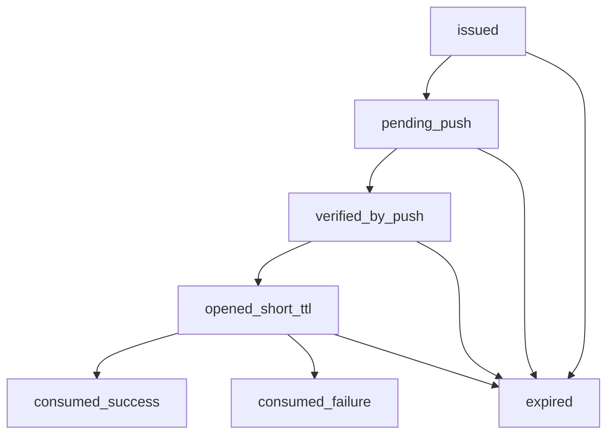

# Repo-Proof Password Management (Challenge-Based)

## Summary

This document proposes a **challenge-based**, **repo-control-proving** mechanism that allows a repository owner to **set / rotate / remove** a project's password protection **without**:

- platform-operator involvement (no `NRDOCS_API_KEY`)
- long-lived repo-management credentials stored on developer machines
- GitHub Actions secrets/variables provisioning for password management
- brittle local `gh` PAT scope troubleshooting as part of the product journey

The design uses two short-lived tokens:

- **private_token**: returned only to the CLI; never committed; required to perform the privileged action
- **public_token**: safe to publish to git; used as a *public proof marker* that a repo push has occurred

The Control Plane “opens” the private token only after it observes a valid repo-control proof (via push-driven verification), and all tokens are **single-use** and **burned after success**.

## Baseline: current architecture (what exists today)

### Password enforcement

- **Where enforced**: Delivery Worker (`src/delivery-worker/index.ts`)
- **Decision**: project record contains `access_mode` = `public|password` and `active_publish_pointer`
- **Password storage**: D1 `projects.password_hash`, versioned by `projects.password_version`
- **Login**: worker renders login page, verifies password hash server-side, issues an HMAC session cookie scoped to the project URL prefix
- **Rate limiting**: failed login attempts are rate-limited per project via D1 `rate_limit_entries` (see `src/auth/rate-limiter.ts`)
- **Audit**: failed logins are recorded as `operational_events` (`login_failure`)

Reference design: `design/05-password-mode.md`.

### Publish auth and repo binding

- Projects are bound to a GitHub repo identity (`projects.repo_identity` in canonical form `github.com/<owner>/<repo>`).
- GitHub Actions OIDC publishing is supported via **Control Plane exchange** (`POST /oidc/publish-credentials`) which maps `claims.repository = owner/repo` to `repo_identity = github.com/owner/repo`, then mints a short-lived repo-scoped token.

Reference guide: `docs/content/guides/oidc-publishing.md`.

### Access mode lifecycle

Older requirements stated `access_mode` immutable (`requirements/02-architecture-requirements.md`), but the product journey requires **public <-> password** transitions. This proposal defines **access mode as mutable** with strict authorization and audit.

## Problem statement

Repo owners commonly start public, then later:

- protect docs with a password for launches / internal previews / early access
- rotate password occasionally
- remove password later

Product goals:

- **repo-owner UX**: one command, guided; no operator involvement
- **security**: no long-lived local credential at rest; no “public push → catastrophic password takeover” risk
- **abuse resistance**: challenge issuance and attempts must be rate-limited to avoid DoS and operational exhaustion
- **operational clarity**: auditable events for each step; easy rollback/disable if abused

## Threat model

Attacker capabilities we must assume:

- Observes public repository pushes (including challenge files)
- Can race requests to Control Plane endpoints
- Can brute-force API endpoints (challenge issuance, password set)
- Can replay old commits / old challenge material
- May not have push access to the repo (typical external attacker), but could have read access

We must prevent:

- Password takeover by a passive observer of the push
- Replay where old challenge markers allow future password changes
- Abuse where attackers spam challenges to create load / block legitimate changes
- Privilege escalation across projects/repos

Non-goals (for Phase 1 of this design):

- Defending against an attacker who already has push rights to the repo (they are a repo owner/collaborator; they can already change docs and publishing); however, we still want audits and bounds.

## Proposed mechanism: repo-proof challenge for password management

### Key idea

Split authority into two requirements:

1. **Repo-control proof**: a repository push includes a well-formed, unexpired **public_token** marker.
2. **Requester continuity proof**: the same CLI session that requested the challenge presents the **private_token**.

Either alone is insufficient.

### Tokens

- `private_token`:
  - random, high-entropy secret (e.g., 256 bits)
  - **never committed**
  - stored only in CLI process memory (and optionally in a temp file during execution)
  - **not stored in plaintext** in D1 (store `private_token_hash = HMAC(server_secret, private_token)` or `SHA-256(private_token + server_salt)`).
- `public_token`:
  - random, high-entropy identifier (e.g., 256 bits)
  - safe to commit; treated as public
  - used to locate challenge record and prove “this push corresponds to this challenge”

Both are single-use and time-limited; both are burned after success.

### State machine



Definitions:

- **issued**: challenge created; tokens minted; no repo proof yet
- **pending_push**: public token is waiting to be observed in a repo push
- **verified_by_push**: Control Plane has confirmed repo proof (public token observed in correct repo/ref)
- **opened_short_ttl**: a short window after verification where password actions can be performed with both tokens
- **consumed_success**: action performed; tokens burned
- **expired**: TTL exceeded; tokens invalid

### Flow: set/rotate password (recommended UX)

1. **CLI → Control Plane**: request challenge for action `set_password`
2. **Control Plane → CLI**: returns `(public_token, private_token, instructions)` + metadata (expiration, required file path)
3. **CLI**: writes challenge marker file containing `public_token` and minimal metadata; prompts user to commit & push
4. **GitHub Actions** (on push) calls Control Plane to notify of the push and provide repo context
5. **Control Plane** verifies:
   - the repo identity matches the project repo binding
   - the pushed content contains the expected `public_token` marker
   - the challenge is not expired and not already used
   - optional: ref policy checks (see below)
   then marks challenge `verified_by_push` and starts a short “opened” TTL window
6. **CLI → Control Plane**: sends password update request including both tokens
7. **Control Plane**: atomically validates + consumes challenge, sets password and/or access mode, records events

### Flow: remove password / disable password mode

Same challenge mechanism, action `set_access_mode public` (and/or `clear_password`) with the same token semantics.

## Why this is secure despite public pushes

Because **public pushes expose only the public_token**.

To actually change a password, an attacker must have:

- the `public_token` (public, easy), AND
- the `private_token` (never committed), AND
- a currently “opened” verification window (short TTL), AND
- a valid challenge record bound to that repo/project/action

Without the `private_token`, observing a push is insufficient.

## Push-driven verification channel

### Why GitHub Actions is still used here

This mechanism uses GitHub only as an **oracle of repo control**:

- “a workflow ran in this repo on this ref” is strong evidence of repo control
- it avoids needing the CLI to hold a long-lived GitHub credential

Crucially, **no GitHub secret is required**. The workflow uses OIDC (same publish trust model) to authenticate to Control Plane for verification calls.

### Verification inputs (minimum)

From the workflow job, Control Plane should receive:

- `repo_identity = github.com/${{ github.repository }}`
- `ref` (branch)
- `sha` (commit)
- the `public_token` extracted from the committed file
- an OIDC-authenticated caller identity (job OIDC token)

### Verification checks

Control Plane must enforce:

- **repo binding**: `repo_identity` maps to exactly one project; project is approved/enabled
- **token binding**: `public_token` matches an outstanding challenge for that project/action
- **time**: challenge unexpired
- **one-time**: public token not already verified/consumed
- **ref policy** (configurable):
  - allow only default branch, or allow only the configured publish branch, or allow any branch
  - recommended default: allow publish branch (same as onboarding trigger branch)
- **content integrity**:
  - verify file path matches expected `.nrdocs/` challenge location
  - verify file format is minimal and robust to parsing

## API contract (proposed)

### 1) Request challenge

`POST /repo-proof/challenges`

Auth: **one of**:

- **OIDC-backed repo proof**: accept GitHub Actions OIDC and bind to repo identity (recommended).
- **Anonymous issuance**: allowed only if rate-limited extremely aggressively and only returns an existing active challenge (never mints new ones without repo proof). This is a fallback mode; see rollout.

Body:

```json
{
  "action": "set_password | disable_password | set_access_mode",
  "project_hint": { "repo_identity": "github.com/owner/repo" },
  "requested_ref_policy": "publish_branch | default_branch | any_branch"
}
```

Response:

```json
{
  "challenge_id": "uuid",
  "public_token": "base64url(...)",
  "private_token": "base64url(...)",
  "expires_at": "ISO",
  "verify_file_path": ".nrdocs/challenges/<challenge_id>.json",
  "opened_ttl_seconds": 120
}
```

Notes:

- `private_token` is returned **once**; Control Plane stores only a hash.
- `public_token` may be embedded in the file contents.

### 2) Verify challenge (workflow callback)

`POST /repo-proof/challenges/:challenge_id/verify`

Auth: GitHub Actions OIDC.

Body:

```json
{
  "repo_identity": "github.com/owner/repo",
  "ref": "refs/heads/main",
  "sha": "commitsha",
  "public_token": "base64url(...)"
}
```

Response:

```json
{
  "status": "verified",
  "opened_until": "ISO"
}
```

Notes:

- Verification MUST record `verify_sha` and `verify_ref`.
- Verification SHOULD record the OIDC `repository`, `run_id`, and `workflow_ref` in audit logs for traceability (without storing the raw OIDC token).

### 3) Set password (consumes both tokens)

`POST /repo-proof/password`

Auth: none beyond possession of both tokens; the tokens themselves are the auth. (Still rate-limit this endpoint.)

Body:

```json
{
  "challenge_id": "uuid",
  "public_token": "base64url(...)",
  "private_token": "base64url(...)",
  "project_id": "uuid",
  "password": "plaintext"
}
```

Password handling rules:

- Password must never be logged.
- Control Plane hashes it before storage and increments `password_version`.
- Setting a password implies `access_mode=password` (common journey).

Server behavior:

- validate `challenge_id` exists, matches project/action, not expired, not consumed
- validate `public_token` matches record, constant-time compare
- validate `private_token_hash` matches, constant-time compare
- validate challenge is currently “opened” (`opened_until > now`)
- atomically consume challenge (transaction) and set password + set `access_mode=password`
- record operational events

Response:

```json
{ "ok": true, "project_id": "uuid", "access_mode": "password" }
```

### 4) Disable password mode (consumes tokens)

`POST /repo-proof/disable-password`

Body similar, without password; server sets `access_mode=public`, clears password hash, bumps password_version.

## Rate limiting and anti-abuse controls

This is mandatory for production.

### Design principles for abuse resistance

- **Idempotent issuance**: repeated “request challenge” calls should generally return the same active challenge (not mint a new one).
- **Bounded outstanding work**: per project/action and per repo identity, there should be a small upper bound of active challenges.
- **Cheap rejection**: invalid/expired tokens and non-opened challenges must fail fast without expensive I/O.
- **Burn on abuse**: after a small number of invalid attempts for a given challenge, burn it to stop oracle probing.
- **Full auditability**: every denial should have a reason code that is safe to expose to the legitimate user.

### Issuance limits

Goals:

- prevent attackers from generating unbounded pending challenges
- prevent exhausting storage / audit logs
- prevent annoying repo owners with push-spam requirements

Policy (recommended defaults):

- **one active challenge per project per action**:
  - if an unexpired unconsumed challenge exists for `(project_id, action)`, return it (idempotent issuance)
- per project (or repo_identity) issuance cap:
  - burst: 2 per 5 minutes
  - sustained: 10 per day
- global per IP cap (best-effort):
  - burst: 5 per 10 minutes
  - sustained: 50 per day

Recommended TTLs:

- **challenge TTL**: 20 minutes
- **opened window TTL**: 120 seconds

Recommended token sizes:

- `public_token`: 32 bytes random, base64url-encoded
- `private_token`: 32 bytes random, base64url-encoded (stored only hashed)

Denial reason codes (examples):

- `rate_limited_project`
- `rate_limited_repo_identity`
- `rate_limited_ip`
- `already_has_active_challenge`

### Verification limits

- verify calls must be OIDC-authenticated and thus are naturally bounded by workflow runs
- still cap to prevent infinite retries (e.g., 10 verify attempts per challenge)

Verification anti-replay and binding:

- On first successful verify, store `verify_sha` and `verify_ref`.
- Subsequent verify calls for the same `challenge_id` must:
  - be idempotent if `sha/ref` match, OR
  - be rejected with `already_verified_different_sha` if they differ.

### Set/disable attempts

- small max attempts per challenge (e.g., 5) then burn the challenge
- ensure constant-time compares on token checks to avoid oracle timing signals

Set/disable anti-replay and double-spend:

- The consume operation must be **atomic**:
  - transition status to `consumed` only once
  - reject concurrent attempts deterministically (`already_consumed`)
- A challenge can only be consumed when:
  - `verified_by_push=true`
  - `opened_until > now`
- After N failed consumes (bad tokens), burn the challenge with status `consumed_failure` and require a new one.

### Observability

Emit `operational_events`:

- `repo_proof_challenge_issued`
- `repo_proof_challenge_verify_success|failure`
- `repo_proof_password_set_success|failure`
- `repo_proof_disable_password_success|failure`

Include:

- `project_id`, `repo_identity`, `ref`, `sha`, reason codes, rate-limit denial reason

Metrics (suggested):

- `repo_proof.challenge.issued.count`
- `repo_proof.challenge.verified.count`
- `repo_proof.challenge.verify_denied.count{reason}`
- `repo_proof.challenge.consume_success.count{action}`
- `repo_proof.challenge.consume_denied.count{reason}`
- `repo_proof.challenge.expired.count`

Alerting (suggested):

- spike in issuance denials by IP (potential DoS)
- spike in consume denials (probing private tokens)
- high verify failures for a single repo (misconfiguration or attack)

## Data model additions

New D1 table: `repo_proof_challenges`

Suggested columns:

- `id` (uuid) / `challenge_id`
- `project_id`
- `repo_identity`
- `action` (enum)
- `public_token` (or its hash; public can be stored as-is)
- `private_token_hash`
- `status` (`issued|verified|consumed|expired`)
- `issued_at`, `expires_at`
- `verified_at`, `opened_until`
- `consumed_at`
- `verify_ref`, `verify_sha`
- `attempt_count_set` (set-password attempts)
- `attempt_count_verify` (verify attempts)
- `last_denial_reason` (optional; for debugging)

Indexes:

- unique on `(project_id, action)` where `status in (issued, verified)` (enforced in code if D1 lacks partial indexes)
- index on `public_token`
- index on `expires_at` for cleanup scans

### Storage and comparison rules

- `private_token` MUST NOT be stored in plaintext.
  - Store `private_token_hash = HMAC(server_secret, private_token)` (preferred) or `SHA-256(private_token + server_salt)`.
- Token comparisons must be constant-time.
- `public_token` may be stored in plaintext (it is public) but should still be treated as an identifier and not logged verbatim.

### Idempotency rules (required)

- **Issue challenge**:
  - If there is an active unexpired unconsumed challenge for `(project_id, action)`, return it.
  - Otherwise create a new challenge.
  - This makes `POST /repo-proof/challenges` safe to retry.
- **Verify challenge**:
  - If already verified with the same `verify_sha` and `verify_ref`, return 200 with the existing `opened_until`.
  - If already verified with different `sha/ref`, return 409 with reason `already_verified_different_sha`.
- **Consume (set password / disable)**:
  - Must be single-use. Any retry after success returns 409 `already_consumed`.
  - Failed consumes increment `attempt_count_set`; after threshold, burn the challenge.

### Atomicity requirements

The consume operation should be implemented as a single atomic update:

- `UPDATE repo_proof_challenges SET status='consumed_success', consumed_at=... WHERE id=? AND status='verified_by_push' AND opened_until > now AND ...token_matches...`
- If `rows_affected != 1`, reject with the appropriate reason code.

This prevents:

- concurrent double-spend
- time-of-check/time-of-use races

### Retention and cleanup

- Minimum retention: 7–30 days for challenge rows (or keep longer but cap size).
- Cleanup process can delete rows where `status in (consumed_success, consumed_failure, expired)` and `created_at < now - retention`.
- Operational audit events should remain the system-of-record for long-term investigation.

## Operational concerns

### Clock skew

Use server-side timestamps. Allow small tolerance (e.g., 30s) for “opened” windows.

### Cleanup

Expired/consumed challenges can be pruned periodically. Keep minimal retention for audits (either separate event log or keep challenge rows for N days).

### Reliability

Workflow delays may cause challenge expiration before verification; defaults should tolerate typical CI delays:

- challenge TTL: 10–30 minutes
- opened TTL: 1–2 minutes

### UX failure modes

- verification never arrives: CLI should offer “check Actions run” guidance
- ref policy violation: clear error message specifying required branch/ref

## Backward compatibility and rollout

### Current state

Password management in the repo-owner experience may currently be attempted via dispatching a workflow and calling Control Plane endpoints with repo-scoped tokens. This design supersedes that by avoiding local `gh` complexity and avoiding storing repo-management tokens long-term.

### Rollout plan

- Add a feature flag in Control Plane: `REPO_PROOF_PASSWORD_CHALLENGE_ENABLED`
- Ship endpoints + table behind flag
- Update CLI to prefer challenge flow when enabled, fall back to existing method when disabled

### Cross-document follow-ups (required)

This design changes user-visible product behavior and must be reflected in docs/requirements:

- `requirements/02-architecture-requirements.md`:
  - Update the “immutability requirements” to remove `access_mode` immutability (or scope it: immutable at registration *unless* changed via repo-proof flow).
- `design/05-password-mode.md`:
  - Add a short section “Password management authority” pointing to this document for how passwords are set/rotated/removed.
- `docs/content/guides/oidc-publishing.md`:
  - Clarify that OIDC is used for publishing credentials, and that password management uses a **repo-proof challenge** mechanism (still secretless; no per-repo secrets/vars).
- `docs/content/guides/administrator.md`:
  - Document operator controls: feature flag, ability to disable password mode org-wide, audit/incident response.
- CLI guide (`docs/content/guides/cli.md`):
  - Document `nrdocs password ...` UX and the push/verify step (once implemented).

### Implementation staging (recommended)

1. **Schema + datastore**: `repo_proof_challenges` table and CRUD with cleanup.
2. **Control Plane endpoints**: issue/verify/consume with strict rate limits and audit events.
3. **Workflow support**: add a lightweight “verify challenge” job step that calls the verify endpoint via OIDC.
4. **CLI support**: implement guided UX to request challenge, write marker file, and complete consume call.
5. **Docs + rollout**: update docs above and ship behind flag; canary on one org first.

## Security checklist (acceptance criteria)

The design is “secure enough” for production only if all below are true:

- challenge issuance is rate-limited and idempotent
- tokens are high entropy and single-use
- `private_token` is stored only hashed at rest
- verification requires OIDC and binds to the correct repo_identity
- action endpoints require both tokens and an opened window
- all success and failure paths produce auditable events with reason codes
- transactions prevent double-spend of tokens
- disabling password clears hash and invalidates sessions (`password_version++`)

## Open questions (explicit)

1. **Auth for challenge issuance**: should `POST /repo-proof/challenges` require OIDC? If yes, how does the CLI obtain it without GH PAT friction (likely by requesting challenge in the workflow itself)?\n2. **Ref policy**: allow any branch vs publish branch only vs default branch only.\n3. **Where should the challenge file live**: `.nrdocs/challenges/...` vs `.github/...` vs docs directory.\n4. **Do we need org-level admin overrides**: e.g. disallow password mode entirely for some orgs.

## Test matrix (must pass before production)

### Unit tests (Control Plane)

- Issue challenge idempotency for same `(project_id, action)`
- Rate limit denials by project/repo identity and by IP
- Verify idempotency with same `(sha, ref)` and 409 on different `(sha, ref)`
- Consume succeeds only when verified and opened window active
- Consume burns tokens and rejects subsequent retries
- Consume rejects wrong `private_token` without leaking which part failed

### Integration tests (happy paths)

- public -> password via challenge: verify + set_password results in Delivery Worker requiring login
- rotate password: old session invalidated (`password_version++`)
- password -> public: password cleared and sessions invalidated

### Adversarial tests

- attacker with only public_token cannot set password
- replay old public_token after consumption fails
- brute force of private_token triggers burn and lockout
- verify from wrong repo_identity fails
