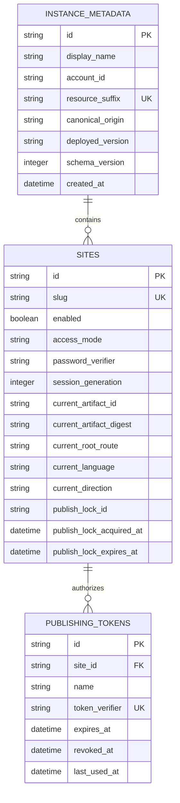

# nrdocs 2.0 Data Model and State Invariants

## Status

This document defines the persistent data model and state transitions for nrdocs 2.0.

It depends on:

- [`00-product-brief.md`](./00-product-brief.md)
- [`01-user-journeys-and-lifecycle.md`](./01-user-journeys-and-lifecycle.md)
- [`02-cli-configuration-and-credentials.md`](./02-cli-configuration-and-credentials.md)
- [`03-system-architecture.md`](./03-system-architecture.md)

This is a clean 2.0 model. It defines no import, migration, or compatibility path from nrdocs 1.x.

The runtime-neutral `persistence` package is the single implementation owner of this schema, its migrations, parameterized operations, row decoding, and state transitions. The administrator CLI and Worker provide execution adapters for that shared implementation; they must not maintain independent SQL or alternative interpretations of these invariants.

## Modeling Principles

1. A site is an independently addressable publishing target, not a repository.
2. A site has exactly one current publication or no publication.
3. Replacing content does not create user-visible versions or history.
4. Site policy is independent of site content.
5. Publishing tokens grant publication authority for one immutable site ID.
6. Reader sessions are stateless and are not persisted as rows.
7. Plaintext secrets never enter D1.
8. Temporary publication state is implementation state, not product state.

## Entity Overview



There is deliberately no repository, user, reader, build, publication, version, audit-log, theme, or custom-domain entity.

## Identifier Rules

Identifiers encode at least 128 cryptographically random bits using lowercase
base32 without padding and carry a type prefix for diagnostics. Implementations
do not derive them from names, timestamps, accounts, repositories, or content.

| Entity | Example | Mutability | User-visible role |
|---|---|---|---|
| Instance | `inst_...` | Immutable | Local instance selection and diagnostics |
| Site | `site_...` | Immutable | Credential binding and publisher destination identity |
| Publishing token record | `tok_...` | Immutable | Administrative token listing and revocation |
| Publication lock | `lock_...` | Temporary | Internal concurrency ownership |
| Artifact | `artifact_...` | Temporary/internal | Private R2 namespace and atomic promotion |

Identifiers are not authorization credentials. Knowledge of an instance, site, token-record, lock, or artifact ID grants no access.

## Time Rules

Persistent timestamps use UTC and a single canonical RFC 3339 representation.

Database comparisons must use instants, not formatted lexical assumptions supplied by clients. The server or Cloudflare control plane supplies authoritative timestamps for server state.

## D1 Schema

The model below is normative in shape and constraints. Exact migration syntax may vary with the D1-supported SQLite version, but implementations must preserve the stated invariants.

### `instance_metadata`

Exactly one row identifies a deployed nrdocs instance.

| Column | Type | Null | Meaning |
|---|---|---:|---|
| `id` | TEXT | No | Immutable opaque instance ID; primary key |
| `display_name` | TEXT | No | Human-readable instance label for administrative output |
| `account_id` | TEXT | No | Selected Cloudflare account ID |
| `resource_suffix` | TEXT | No | Immutable random Cloudflare resource-name suffix |
| `canonical_origin` | TEXT | No | Single canonical HTTPS origin |
| `deployed_version` | TEXT | No | Installed nrdocs package version |
| `schema_version` | INTEGER | No | Current 2.x database-schema version |
| `created_at` | TEXT | No | Instance creation time |

Constraints:

- The table contains exactly one row after a successful deployment.
- `display_name` is Unicode NFC, trimmed, contains 1–80 Unicode scalar values, and contains no control characters.
- The display name is descriptive metadata only. It is not required to be unique and never replaces the opaque instance ID in selection, foreign keys, Cloudflare resource lookup, routing, or authorization.
- `schema_version` describes internal database compatibility. It is not a site or content version.
- The instance ID and display name in a local descriptor must match this row before an administrator mutation proceeds. A mismatch is a descriptor-consistency error and does not trigger automatic rewriting.

### `sites`

One row represents one publishing and serving target.

| Column | Type | Null | Meaning |
|---|---|---:|---|
| `id` | TEXT | No | Immutable opaque site ID; primary key |
| `slug` | TEXT | No | Mutable root-level URL slug; unique |
| `enabled` | INTEGER | No | `1` when serving is enabled, otherwise `0` |
| `access_mode` | TEXT | No | `public` or `password` |
| `password_verifier` | TEXT | Yes | Encoded reader-password verifier |
| `session_generation` | INTEGER | No | Monotonic reader-session invalidation counter |
| `current_artifact_id` | TEXT | Yes | Current private R2 artifact prefix ID |
| `current_artifact_digest` | TEXT | Yes | Digest of the current normalized artifact |
| `current_root_route` | TEXT | Yes | Root page route or first-page redirect target |
| `current_language` | TEXT | Yes | Current manifest's canonical BCP 47 language tag |
| `current_direction` | TEXT | Yes | Current manifest's `ltr`, `rtl`, or `auto` text direction |
| `current_page_count` | INTEGER | Yes | Current manifest page count |
| `current_asset_count` | INTEGER | Yes | Current inline-asset count |
| `current_attachment_count` | INTEGER | Yes | Current linked-download count |
| `last_published_at` | TEXT | Yes | Last successful promotion time |
| `publish_lock_id` | TEXT | Yes | Current publication lock owner |
| `publish_lock_acquired_at` | TEXT | Yes | Original acquisition time for the current lock |
| `publish_lock_expires_at` | TEXT | Yes | Time after which a stale lock may be reclaimed |
| `created_at` | TEXT | No | Site creation time |
| `updated_at` | TEXT | No | Last successful site-state mutation time |

#### Slug constraints

A slug:

- is 1 to 63 characters;
- contains only lowercase ASCII letters, digits, and hyphens;
- begins and ends with a letter or digit;
- is unique within the instance; and
- is not a platform-reserved root segment such as `_nrdocs`.

The equivalent shape is:

```text
^[a-z0-9](?:[a-z0-9-]{0,61}[a-z0-9])?$
```

The one-character case is valid. Slug normalization is never guessed: invalid input is rejected rather than silently rewritten.

#### Access invariant

The following relationship must always hold:

| `access_mode` | `password_verifier` |
|---|---|
| `public` | `NULL` |
| `password` | Non-`NULL` valid encoded verifier |

Changing a password, removing password access, or restoring password access increments `session_generation` in the same transaction as the access change.

Disabling or enabling a site does not change its access mode, password verifier, or session generation.

#### Current-publication invariant

A site is empty when all of these columns are `NULL`:

- `current_artifact_id`
- `current_artifact_digest`
- `current_root_route`
- `current_language`
- `current_direction`
- `current_page_count`
- `current_asset_count`
- `current_attachment_count`
- `last_published_at`

A site has content when all of them are non-`NULL` and counts are non-negative.

When content exists, `current_language` is the validated canonical language from the current manifest and `current_direction` is exactly `ltr`, `rtl`, or `auto`. They are copied into the current-publication tuple so fixed password-entry and other pre-artifact access pages can set their document language and direction without reading or trusting an artifact first.

The tuple changes only in one successful promotion transaction. It must never describe a partially written artifact.

`current_root_route` is either `/` when the publication contains a root page or the canonical route of the first navigable page when the site root redirects.

#### Publication-lock invariant

`publish_lock_id`, `publish_lock_acquired_at`, and
`publish_lock_expires_at` are either all `NULL` or all non-`NULL`.

A lock is owned only by the request whose opaque lock ID matches the row. A request must not promote an artifact or release a lock owned by another request.

An expired lock may be atomically replaced. Expiration is recovery from an interrupted request; it is not a publication history or queue.

### `publishing_tokens`

One row represents one named site-scoped publishing credential.

| Column | Type | Null | Meaning |
|---|---|---:|---|
| `id` | TEXT | No | Immutable token-record ID; primary key |
| `site_id` | TEXT | No | Owning immutable site ID; foreign key |
| `name` | TEXT | No | Administrator-chosen name unique within the site |
| `token_verifier` | TEXT | No | Indexed encoded verifier or one-way token digest |
| `expires_at` | TEXT | Yes | Optional expiration instant; `NULL` means no scheduled expiration |
| `revoked_at` | TEXT | Yes | Revocation time; `NULL` means not revoked |
| `last_used_at` | TEXT | Yes | Best-effort last successful authentication time |
| `created_at` | TEXT | No | Issuance time |

Required constraints and indexes:

- Foreign key `site_id` references `sites(id)` with cascading deletion.
- `(site_id, name)` is unique.
- `token_verifier` is unique and indexed for authentication lookup.
- A token is usable only when `revoked_at IS NULL` and `expires_at` is `NULL` or in the future.
- Revocation is irreversible for that record.
- The plaintext token is returned exactly once when issued and is never recoverable from this row.

`last_used_at` is operational metadata. After successful authentication the
Worker attempts a conditional update no more than once per token per 15
minutes. The update is best-effort and must not participate in authorization or
correctness.

### `schema_migrations`

An internal migration ledger may record forward database migrations within the 2.x product line.

This table does not permit importing a 1.x deployment and does not represent content versions.

## State Model

### Site state is composed, not enumerated

Serving behavior is the result of three independent dimensions:

| Dimension | Values |
|---|---|
| Lifecycle | Enabled / disabled / deleted |
| Content | Empty / published |
| Reader access | Public / password |

Deleted is terminal and means the row no longer exists. All other combinations are valid.

| Enabled | Content | Result to unauthenticated reader |
|---:|---|---|
| Yes | Empty | 404 |
| Yes | Published, public | Serve current publication |
| Yes | Published, password | Request password, then serve |
| No | Empty or published | 404 |

Publishing is allowed while a site is disabled. A successful publish changes only the current-publication tuple.

### Site creation

`nrdocs site create` atomically inserts a site with:

```yaml
enabled: true
access_mode: public
password_verifier: null
session_generation: 1
current_publication: null
publication_lock: null
```

The administrator may select password access as part of the creation flow. In that case, `access_mode` and `password_verifier` are written consistently in the creation transaction.

Site creation also inserts one initial named publishing-token record in the same transaction. The command explicitly prompts for the token name and displays the generated plaintext token once after the transaction succeeds.

If the site row and initial token row cannot both be committed, neither is committed.

### Rename

Rename atomically updates only `slug` and `updated_at` after uniqueness and reserved-name validation.

It does not:

- change the site ID;
- change or reissue tokens;
- move artifacts;
- rewrite local publisher configuration;
- retain the old slug; or
- create a redirect.

The old URL returns 404 immediately after the transaction commits.

### Enable and disable

Enable and disable atomically update only `enabled` and `updated_at`.

Disablement preserves current content, reader-password state, publisher tokens, and the ability to publish. Enablement makes the current content visible again if content exists.

### Reader-access changes

#### Public to password

The transaction:

1. writes the new encoded password verifier;
2. changes `access_mode` to `password`;
3. increments `session_generation`; and
4. updates `updated_at`.

#### Password change

The transaction replaces `password_verifier`, increments `session_generation`, and updates `updated_at`.

#### Password to public

The transaction:

1. sets `password_verifier` to `NULL`;
2. changes `access_mode` to `public`;
3. increments `session_generation`; and
4. updates `updated_at`.

The generation increment invalidates every previously issued reader session without storing a session list.

### Publishing-token lifecycle

#### Issue

The administrator CLI generates a high-entropy plaintext token locally, writes only its verifier and metadata, and displays the plaintext once.

Token names help humans distinguish credentials such as `noam-laptop` and `docs-ci`; they do not affect authorization.

When a TTL is supplied, issuance validates the shared duration grammar and adds its exact number of seconds to the authoritative database time inside the issuance transaction. The resulting `expires_at` value is stored in canonical UTC RFC 3339 form. The administrator-workstation clock, timezone, and daylight-saving rules do not participate.

#### Authenticate

The Worker resolves exactly one active token record from the presented token verifier. The owning `site_id` is the authority carried by that token.

The client-supplied site ID is an expected-target assertion. It must equal the token's owning site ID; it never grants or expands authority.

#### Revoke

Revocation atomically sets `revoked_at` if it is currently `NULL`. Repeating the operation is idempotent and does not restore the token.

#### Delete site

Deleting the owning site removes all token rows through the foreign-key cascade. There is no orphan-token state.

### Publication state transition

Only the Worker may promote a publication.

The state change is logically:

```text
(site_id, held_lock_id, previous_current_artifact)
  -> validate complete staged artifact
  -> conditionally replace the complete current-publication tuple
  -> clear the same held lock
```

The promotion update succeeds only when:

- the site still exists;
- the authenticated token still belongs to it and remains usable at the authorization boundary defined by the API;
- `publish_lock_id` still equals the request's lock ID; and
- the staged artifact is complete.

If the artifact digest already equals `current_artifact_digest`, publication succeeds idempotently without changing the pointer or creating durable history. `last_published_at` should remain the time of the actual current-artifact promotion, not a no-op request.

### Site deletion

Deletion is permanent and has no tombstone visible to the product.

The administrative operation uses this order:

1. atomically disable the site and revoke all of its active publishing tokens;
2. prevent or wait out the now-unrenewable active publication lock;
3. delete every `sites/{site_id}/` R2 object;
4. delete the D1 site row, cascading token deletion; and
5. report success only when both stores are clear.

Conditional promotion requires the publishing token to remain usable. The first transaction therefore prevents a previously authenticated in-flight request from promoting after deletion begins and prevents any new request from acquiring authority.

If R2 deletion fails, the disabled D1 row and revoked token rows remain so the operation can be retried safely. Deletion is already irreversible at this point; there is no command to restore the revoked tokens. The CLI must not report successful deletion while artifacts remain intentionally addressable by the row.

After successful deletion:

- the site ID is no longer resolvable;
- the former slug may be reused;
- all former tokens fail authentication;
- reader sessions fail because their site no longer exists; and
- there is no recovery or restore operation.

## Publication Concurrency

### Lock acquisition

A publish request atomically acquires the site lock when either:

- no lock exists; or
- the existing lock has expired.

The update writes a new random `publish_lock_id`, the server acquisition time,
and the expiration required by `07-security-and-resource-limits.md`. A request
that cannot acquire the lock receives the specified conflict response rather
than entering a server-side queue.

### Lock renewal

Only the lock owner may renew it. The 120-second lease, 60-second renewal
threshold, and ten-minute hard lifetime in the security specification are
mandatory; renewal must not turn the Worker request into a durable background
process.

### Promotion and release

Successful promotion and lock release occur in the same D1 transaction when supported, or in equivalent conditional statements that preserve ownership.

On a recoverable failure, the owner clears its lock. On interruption, expiration permits a later request to reclaim it.

### No history through concurrency metadata

Locks, staging prefixes, request IDs, and cleanup retries must not be exposed as builds or revisions. They may appear in operator diagnostics for bounded retention but are not queryable product objects.

## Artifact State in R2

D1 is the authority for which R2 prefix is current.

An R2 prefix is in one of three implementation states:

| State | D1 relationship | Required behavior |
|---|---|---|
| Staging | Referenced only by the active request | Never served |
| Current | Matches `sites.current_artifact_id` | May be served after access checks |
| Obsolete/orphaned | Not current and not active staging | Delete best-effort |

Only the current pointer confers serving eligibility. Object existence alone never makes content public.

The implementation must attempt to remove:

- failed staging prefixes;
- the formerly current prefix after successful replacement; and
- expired-lock staging prefixes discovered during later safe cleanup.

Cleanup failure does not roll back a successful pointer promotion. It is an operational storage leak, not publication ambiguity.

## Local State Is Not Server State

The following local files are references and credentials, not authoritative site records:

```text
~/.nrdocs/instances/<opaque-instance-id>.json
~/.nrdocs/active-instance
~/.nrdocs/sites/<opaque-site-id>.json
<publication-directory>/nrdocs.yml
```

Deleting a local credential does not revoke its server token. Revoking a server token does not require or guarantee removal from every machine. `nrdocs credentials remove` and `nrdocs token revoke` therefore remain intentionally distinct operations.

The exact local schemas and permission rules are defined in [`02-cli-configuration-and-credentials.md`](./02-cli-configuration-and-credentials.md).

## Explicitly Absent Data

nrdocs 2.0 does not persist:

- source repository URLs, providers, branches, or commits;
- source Markdown or `nrdocs.yml` as downloadable source;
- previous artifact pointers;
- publish history or rollback points;
- drafts, approvals, or scheduled publications;
- administrator accounts or roles;
- reader accounts, password-reset data, or per-reader grants;
- visitor analytics;
- source ZIP files; or
- site-specific renderer configuration beyond the published artifact manifest.

## Acceptance Criteria

The data model is conforming when all of the following are true:

1. Every site has an immutable ID and exactly one mutable unique slug.
2. A site is empty or points to one complete current artifact; no partial state is representable.
3. Reader access and enabled state can change without touching artifacts.
4. Publishing can replace content without changing access policy or tokens.
5. Multiple independently revocable named publishing tokens can belong to one site.
6. No plaintext publisher token or reader password is stored.
7. Password changes and removal invalidate old reader sessions through one atomic generation change.
8. Concurrent publication attempts cannot both promote artifacts.
9. Deleting a site permanently removes its metadata, token rows, and artifact objects.
10. The schema contains no repository, publication-history, version, or reader-account model.
