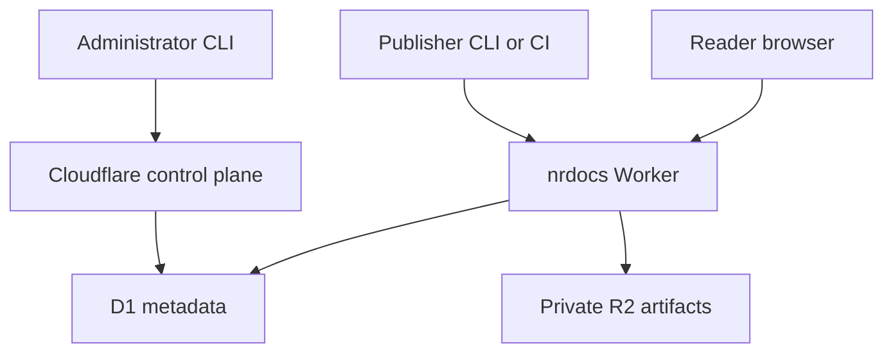
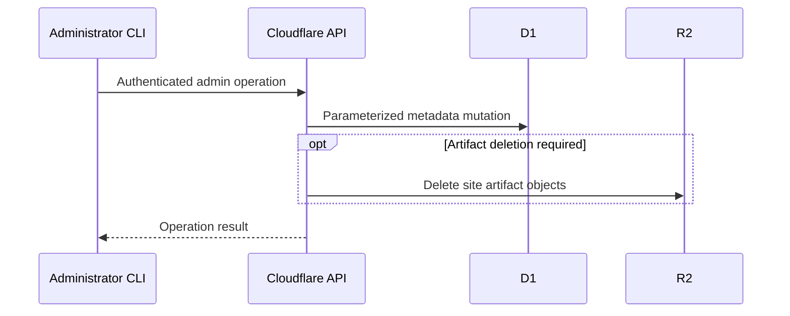
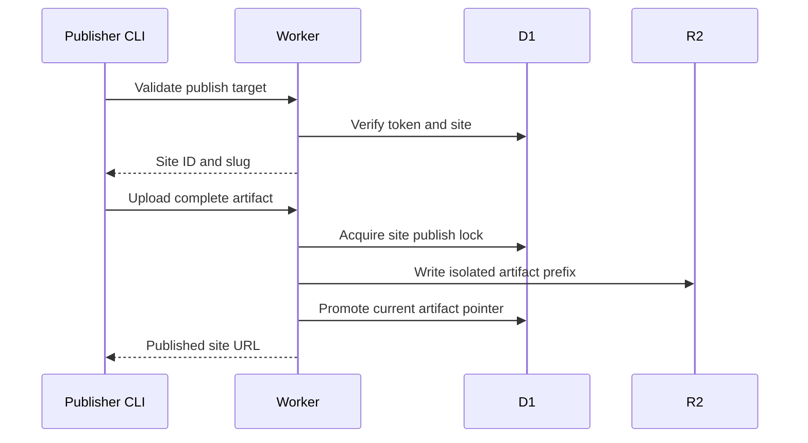
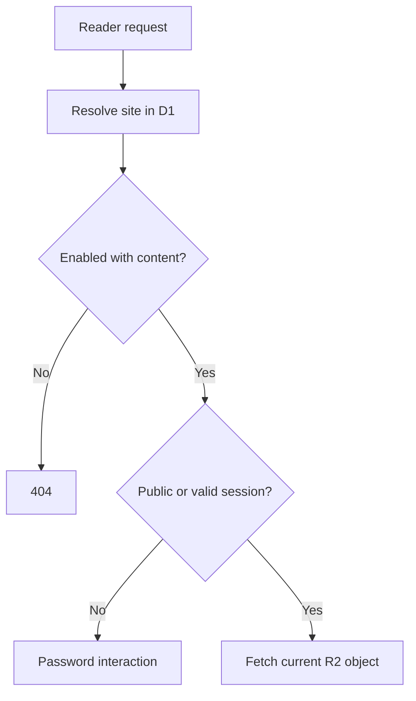

# nrdocs 2.0 System Architecture

## Status

This document defines the system architecture for nrdocs 2.0.

It depends on:

- [`00-product-brief.md`](./00-product-brief.md)
- [`01-user-journeys-and-lifecycle.md`](./01-user-journeys-and-lifecycle.md)
- [`02-cli-configuration-and-credentials.md`](./02-cli-configuration-and-credentials.md)

Security algorithms, resource limits, deployment permissions, and operational hardening are specified separately. They must preserve the boundaries defined here.

## Architectural Summary

nrdocs has three independent paths:



### Administrative path

```text
Administrator CLI
  -> Cloudflare authentication
  -> Cloudflare control-plane APIs
  -> D1 and R2 administration
```

### Publishing path

```text
Publication directory
  -> local validation and rendering
  -> local artifact packaging
  -> site-scoped token authentication
  -> Worker publish endpoint
  -> private R2 staging prefix
  -> atomic D1 current-artifact switch
```

### Reader path

```text
Reader browser or AI agent
  -> Worker route resolution
  -> D1 site-state and access check
  -> private R2 object fetch
  -> controlled response (HTML reader, or stored agent Markdown/JSON/media)
```

The architecture contains no persistent application server, user-account service, repository integration, build worker, or administrator API.

## Required Platform Model

The initial 2.0 deployment uses Cloudflare-managed serverless components.

| Component                | Responsibility                                                                                                    |
| ------------------------ | ----------------------------------------------------------------------------------------------------------------- |
| nrdocs CLI               | Deployment, administration, directory connection, validation, rendering, preview, packaging, and publication      |
| Cloudflare control plane | Administrator authentication and resource administration                                                          |
| Cloudflare Worker        | Publish-token validation, artifact ingestion, reader authentication, routing, and serving                         |
| Cloudflare D1            | Authoritative site, token, access, lock, and current-artifact metadata                                            |
| Cloudflare R2            | Private storage for the current artifact and temporary publication prefixes                                       |
| Reader browser           | Rendering the fixed site interface, holding a site-scoped reader session, and copying Share-with-LLM instructions |

The implementation shares two runtime-neutral TypeScript boundaries between the CLI and Worker:

- a contracts package for schemas, identifiers, protocol types, artifact validation, MIME mappings, and cryptographic formats; and
- a persistence package for the 2.0 D1 schema, migrations, parameterized operations, row decoding, state-transition invariants, and deterministic private R2 key construction.

Neither shared package performs network I/O or selects Cloudflare credentials. The Worker executes shared persistence operations through its D1 binding. The administrator CLI executes the same operations through a Cloudflare control-plane adapter.

## Architectural Invariants

### 1. No Server-Side Source Build

The Worker receives a completed static artifact. It does not:

- clone a repository;
- read a local publisher directory;
- execute package installation;
- run Markdown plugins;
- invoke a shell;
- run an arbitrary build command; or
- transform publisher-controlled executable content.

### 2. No Repository Identity

The server does not store or derive Git provider, repository, branch, commit, or workflow identity.

Site identity comes from the server-issued immutable site ID. Publishing authority comes from a site-scoped token.

### 3. No Administrator Application API

The Worker exposes no endpoint for site creation, access changes, token issuance, rename, enablement, disablement, or deletion.

Administrative commands use Cloudflare authority and the selected instance descriptor to modify the controlled resources directly.

### 4. Private Artifact Storage

R2 is not public. Readers never receive an R2 URL or a storage credential.

All serving passes through the Worker after site-state and reader-access evaluation.

### 5. One Current Publication

D1 stores one current artifact pointer for each site. No publication-history table or user-visible build record exists.

Staging identifiers and prefixes are temporary implementation state. They are not versions and are never exposed as reader or publisher resources.

### 6. Atomic Replacement

The current artifact pointer changes only after the new artifact is completely received, validated, extracted, and stored.

A failure before pointer promotion leaves the previous pointer unchanged.

### 7. Site Policy Is Independent of Content

Site lifecycle, reader access, password hash, and publisher tokens are D1 metadata. Publishing content does not modify them.

Administrative policy changes do not rebuild, copy, or rewrite site content.

### 8. Durable State Is External

Correctness must not depend on Worker process memory, a long-running process, local CLI state after a request begins, or a background daemon.

Authoritative server state lives in D1 and R2.

## Main Components

### 1. nrdocs CLI

The CLI is the only authoring-side component.

### Publisher responsibilities

- Resolve the exact publication directory.
- Load and validate `nrdocs.yml`.
- Resolve the exact site credential.
- Validate the token target before upload.
- Discover or read navigation.
- Validate Markdown, routes, links, and assets.
- Render the fixed static site.
- Construct the artifact manifest.
- Package the artifact.
- Upload it to the Worker.
- Report whether promotion succeeded.

### Preview responsibilities

- Use the same validation and rendering pipeline as publication.
- Serve the generated output from an ephemeral local HTTP server.
- Avoid persistent build output and network publication.

### Administrator responsibilities

- Resolve the selected local instance descriptor.
- Resolve Cloudflare authentication without copying it into nrdocs storage.
- Provision and update the fixed Cloudflare resources.
- Create and mutate site metadata through D1 control-plane operations.
- Generate publishing-token secrets locally and store only their verifier in D1.
- Hash reader passwords before writing their verifier to D1.
- Coordinate site deletion across D1 and R2.

### Prohibited CLI behavior

The CLI must not:

- infer a publisher destination;
- persist Cloudflare credentials;
- store a publishing token in `nrdocs.yml`;
- create Git or CI configuration;
- upload source Markdown or unreferenced files; or
- expose an intermediate artifact as a supported user-facing build output.

### 2. nrdocs Worker

One Worker may implement publishing and serving routes in the same deployed application.

The compiled Worker, D1 migrations, fixed platform CSS and JavaScript, and deployment metadata are build outputs bundled inside the same published `nrdocs` npm package as the CLI. Deployment consumes only those package-owned resources and never resolves a compatible server component dynamically from Git, npm, a CDN, or another local project.

### Publishing responsibilities

- Authenticate a publishing token.
- Resolve its immutable site ID.
- Reject an expected-site mismatch.
- Enforce token status and optional expiration.
- Serialize publication attempts per site.
- Validate package structure and manifest consistency.
- Parse rendered pages and enforce the fixed safe page schema.
- Write extracted files to an isolated private R2 prefix.
- Promote the completed artifact through one conditional D1 update.
- Release the publication lock.
- Return the canonical site URL and manifest counts.

### Serving responsibilities

- Serve the generic instance root.
- Resolve a root-level site slug through D1.
- Return 404 for unknown, deleted, disabled, or empty sites.
- Enforce public or password access.
- Establish and invalidate site-scoped reader sessions.
- Resolve canonical page routes and referenced assets through the current manifest.
- Fetch only from the current private R2 prefix.
- Apply platform-controlled response headers and MIME behavior.
- Serve fixed platform assets under `/_nrdocs/`.

### Prohibited Worker behavior

The Worker must not:

- expose an administrator mutation endpoint;
- build Markdown;
- accept arbitrary static websites;
- execute publisher code;
- trust publisher-supplied HTML without structural validation;
- expose R2 directly;
- retain a user-visible publication log; or
- use request memory as authoritative lock or site state.

### 3. D1 Metadata Store

D1 is authoritative for:

- immutable instance identity and its human-readable display name;
- immutable site identity;
- current site slug;
- enabled or disabled state;
- public or password reader access;
- password verifier and session generation;
- current artifact pointer and digest;
- publication serialization state;
- publishing-token verifiers, names, expiration, revocation, and last use; and
- creation and update timestamps.

D1 does not store:

- source Markdown;
- rendered page bodies;
- original attachments;
- plaintext reader passwords;
- plaintext publishing tokens;
- Cloudflare credentials;
- Git metadata;
- publication history; or
- reader-account records.

### 4. R2 Artifact Store

R2 stores extracted static artifact objects under opaque site and temporary artifact prefixes.

Recommended logical structure:

```text
sites/{site_id}/artifacts/{artifact_id}/nrdocs-manifest.json
sites/{site_id}/artifacts/{artifact_id}/pages/index.html
sites/{site_id}/artifacts/{artifact_id}/pages/overview/index.html
sites/{site_id}/artifacts/{artifact_id}/assets/images/diagram.png
sites/{site_id}/artifacts/{artifact_id}/attachments/evidence.pdf
```

`artifact_id` is an internal temporary publication identifier. Only the prefix referenced by `sites.current_artifact_id` is serveable.

The bucket contains no public binding and no human-readable site slug in object keys.

### 5. Local Publisher Store

The local publisher store contains one protected file per opaque site ID:

```text
~/.nrdocs/sites/{site_id}.json
```

This state is authoritative only for local credential lookup. It never defines server-side authorization or site identity.

### 6. Local Instance Store

The local instance store contains non-secret Cloudflare resource descriptors and one active-instance pointer:

```text
~/.nrdocs/instances/{instance_id}.json
~/.nrdocs/active-instance
```

The descriptor selects Cloudflare resources. Cloudflare authentication remains external to nrdocs.

The descriptor also caches the required instance display name for local output. The Worker-side D1 row remains the authoritative copy used to verify descriptor consistency. The display name is not an identity, command target, hostname, resource key, or authorization input.

## Administrative Architecture

### Control-plane model

Administrative commands bypass the public Worker and operate through Cloudflare's authenticated control plane.



### Shared implementation rules

The CLI and Worker must share:

- identifier formats;
- normalized slug validation;
- database schema expectations;
- publishing-token encoding and verification format;
- password-verifier format;
- access-mode invariants; and
- session-generation semantics.

This prevents direct control-plane mutations from creating states the Worker cannot interpret.

### Shared persistence boundary

The CLI and Worker must not maintain independent SQL, migrations, row decoders, or state-transition rules.

The runtime-neutral persistence package owns:

- the clean nrdocs 2.0 migration baseline and subsequent 2.0 migrations;
- parameterized D1 statements and transaction/batch definitions;
- validated row-to-domain decoding;
- site, token, lock, publication-pointer, and session-generation transitions;
- invariant checks that supplement database constraints; and
- opaque R2 site/artifact key construction where the key is independent of a particular Cloudflare client.

Execution remains adapter-specific:

- the Worker adapter executes operations through the Worker D1 binding and uses its R2 binding;
- the administrator CLI adapter executes D1 operations through authenticated Cloudflare control-plane calls and performs administrative R2 operations through the separately locked Cloudflare credential flow; and
- the persistence package imports neither Worker APIs, Wrangler, Node filesystem APIs, nor a Cloudflare authentication client.

Cross-resource orchestration, including site deletion across D1 and R2, remains a CLI responsibility. The persistence package supplies the required atomic metadata transitions but does not conceal remote side effects inside repository functions.

### Cloudflare administration feasibility gate

The no-administrator-API architecture depends on supportable control-plane operations for both D1 and R2. Before the production workspace is accepted, a disposable non-production spike must prove the exact supported Cloudflare authentication and execution path for:

- Worker upload and D1/R2 binding reconciliation from an arbitrary directory;
- an atomic parameterized D1 batch using the same operation definition consumed by the Worker adapter;
- listing and deleting all R2 objects under one opaque site prefix without persisting a Cloudflare credential in nrdocs state; and
- uploading and streaming a representative publication archive within the selected Worker runtime limits.

The spike must record the credential type and minimum permissions actually
used. It verifies the locked R2 REST object flow with the resolved Cloudflare
bearer token; nrdocs does not use the R2 S3 interface. If the current REST flow
cannot provide suitably scoped R2 administration, implementation stops and
this administrative boundary is revised explicitly; the coding agent must not
add a hidden Worker administrator route or persist a long-lived R2 secret as a
workaround.

### Site creation

The administrator CLI generates:

- site ID;
- initial token ID and secret;
- token verifier;
- optional password verifier; and
- timestamps.

It writes the site and initial token in one D1 batch or transaction. A password-protected site must never be committed without a password verifier.

### Site deletion

Deletion is coordinated as:

```text
1. Atomically disable the site and revoke all of its publishing tokens.
2. Prevent or wait out the now-unrenewable publication lock.
3. Delete all R2 objects under the opaque site prefix.
4. Delete the site row and cascading token rows.
5. Report completion.
```

Revoking tokens before storage deletion prevents a new publication from racing the delete. An in-flight publication must recheck usable-token state as part of conditional promotion and therefore cannot promote after deletion begins.

If storage deletion fails, final metadata deletion must not proceed. The site remains disabled with its tokens revoked, and the command may be retried.

No recoverable deleted state is created.

## Publication Architecture

### Local phase

Rendering and most validation occur before any artifact upload:

```text
load configuration
reject symbolic-link publication inputs
resolve and validate destination
build page allowlist
validate route uniqueness
decode and normalize UTF-8 Markdown input
parse and validate Markdown
resolve local links and assets
render HTML
construct manifest
package archive
```

The local pipeline never traverses symbolic-link directories or reads a symbolic-link publication root, configuration, selected page, referenced asset, or referenced attachment. Selected source paths and generated paths pass the shared exact and portable collision checks before rendering.

Every rendered page is a complete HTML5 document. The artifact never contains page fragments for later shell assembly. The document includes the fixed nrdocs navigation, main-content, and previous/next regions, carries the publication's effective canonical BCP 47 language and `ltr`, `rtl`, or `auto` direction on its `html` root, and references only versioned platform CSS and JavaScript under `/_nrdocs/`.

The document remains independent of the current site slug and hostname. Links to pages, assets, and attachments within the artifact are generated relative to the current page route. A site rename therefore requires no artifact rewrite or republish.

The Worker validates each complete document before promotion and then serves the stored document as a unit. It does not wrap fragments, inject a template, rewrite links, or substitute publisher-controlled values at request time. Reader-access and error pages produced by the platform are separate fixed platform documents.

### Server phase



### Publication serialization

Only one publication attempt may hold a site's server-side publication lock.

The lock is durable D1 state with an expiration. A competing publication receives a conflict response and does not upload or promote content.

An expired lock may be reclaimed. Lock timeout and recovery rules are defined in the API and security specifications.

### Artifact identity and idempotency

The rendered package has a content digest.

The site row stores the current artifact digest. If a valid publish request presents the same digest as the current artifact, the server returns the existing successful result without creating another artifact prefix.

This supports retry after an uncertain network response without creating publication-history state.

### Promotion

Promotion is a conditional D1 update that requires:

- the expected site ID;
- ownership of the current publication lock;
- the staged artifact ID;
- completed server validation; and
- unchanged relevant lifecycle identity.

Promotion updates:

- current artifact ID;
- current artifact digest;
- current manifest summary, including root route, counts, language, and direction;
- last successful publication timestamp; and
- publication lock state.

It does not alter slug, enabled state, access mode, password, or tokens.

### Cleanup

After promotion, the previous artifact prefix is no longer serveable and should be deleted.

Failed or interrupted staging prefixes are best-effort deleted immediately. Before or after a later successful publish, the Worker may list the site's artifact prefix and delete every non-current artifact.

No scheduled garbage collector is required for correctness in the initial implementation. Cleanup failures are operational storage leaks, not user-visible versions.

## Reader Architecture

### Route resolution

The Worker reserves:

```text
/_nrdocs/*
```

All other first path segments are candidate site slugs. A first segment that differs from a valid slug only by ASCII case is redirected (308) to the lowercase canonical path.

Canonical site route:

```text
/{site-slug}/
```

### Reader request flow



### Password sessions

Reader sessions are signed, site-scoped cookies and require no session table.

The cookie identifies:

- site ID;
- session-generation value; and
- expiration.

Changing or removing the password increments the site's session generation. Existing cookies then fail validation without requiring a session-row deletion operation.

Exact signing, cookie, CSRF, password-rate-limit, and lifetime rules are
normative in `07-security-and-resource-limits.md`.

### Content resolution

The current manifest maps canonical page routes and asset paths to object paths inside the current R2 prefix.

The Worker does not perform directory listings or fall back to arbitrary R2 keys.

Requests for a path absent from the manifest return 404.

## Failure Isolation

### CLI validation failure

No upload begins. The current site is unchanged.

### Token validation failure

No artifact is accepted. The current site is unchanged.

### Lock conflict

The second publisher receives a conflict and retry instruction. The active publication proceeds independently.

### Interrupted upload

The current D1 pointer is unchanged. The incomplete staging prefix is not serveable.

### R2 extraction or validation failure

The staging prefix is rejected and cleaned up when possible. The current pointer is unchanged.

### D1 promotion failure

The staged prefix is not current and is not serveable. The previous current pointer remains authoritative.

### Post-promotion cleanup failure

The newly promoted artifact remains current. The previous prefix is orphaned but unreachable and may be removed later.

### Reader storage miss

If D1 references an object absent from R2, the Worker returns a controlled server error or 404 according to the later serving specification and records an operational failure. It must not fall back to a non-current prefix.

## Caching Boundary

Caching is optional and never authoritative.

Any cache must preserve immediate correctness for:

- site disablement;
- password enablement;
- password change;
- password removal;
- site rename;
- site deletion; and
- artifact promotion.

The implementation uses the conservative, exact cache and conditional-request
behavior in `09-fixed-reader-and-serving.md`. Site content is private and
no-store; only fixed platform assets are briefly cacheable and revalidated.

## Observability Boundary

The architecture may use Cloudflare logs and metrics for operational visibility.

nrdocs 2.0 does not require a persistent application audit-log table, publication-history table, or public diagnostics endpoint.

Logs must not contain plaintext publishing tokens, reader passwords, session cookies, full artifact bodies, or Cloudflare credentials.

## Non-Persistent Requirement

The following are prohibited:

- persistent application servers;
- long-running containers;
- VM-hosted daemons;
- authoritative in-memory state;
- server-side source workspaces;
- background build workers;
- repository clone services; and
- correctness-dependent scheduled jobs.

Managed serverless requests and durable Cloudflare storage are sufficient for all required behavior.

## Architecture Non-Goals

The initial architecture does not include:

- Git provider integration;
- administrator or publisher accounts;
- administrator Worker endpoints;
- reader account storage;
- web administration;
- source cloning;
- server-side rendering from Markdown;
- arbitrary site artifacts;
- publication history;
- rollback;
- hosted preview deployments;
- search indexing;
- queues or scheduled cleanup required for correctness;
- per-site custom domains; or
- multi-tenant SaaS isolation.

## Architecture Acceptance Criteria

An implementation satisfies this architecture when:

1. A plain local directory can be rendered and published without Git.
2. The Worker receives only a completed fixed-format static artifact.
3. A publishing token resolves to exactly one immutable site ID.
4. The Worker exposes no administrative mutation API.
5. Cloudflare authority is required for administrative changes.
6. R2 is private and readable only through controlled Worker routes.
7. D1 has one current artifact pointer per site and no publication-history entity.
8. Partial or failed uploads cannot replace current content.
9. Concurrent publication attempts cannot corrupt or interleave one site's artifact.
10. Policy changes do not rebuild or copy artifacts.
11. Reader access is evaluated before every private artifact fetch.
12. No persistent server or background worker is required for correctness.
13. The CLI and Worker execute one shared migration and persistence-operation model rather than maintaining parallel SQL.
14. Published pages are complete slug-neutral HTML documents served without runtime shell assembly or link rewriting.
15. A disposable feasibility gate has proven the required D1, R2, deployment, streaming-ingestion, and cleanup paths without adding nrdocs-held Cloudflare credentials.
