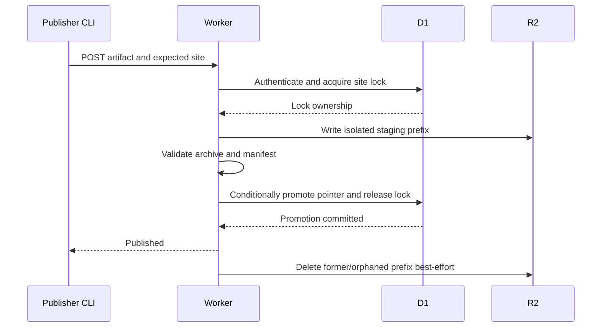

# nrdocs 2.0 Publication API and Artifact Lifecycle

## Status

This document defines the publisher-facing HTTP API, publication package, validation contract, atomic replacement flow, and reader-serving boundary for nrdocs 2.0.

It depends on:

- [`00-product-brief.md`](./00-product-brief.md)
- [`01-user-journeys-and-lifecycle.md`](./01-user-journeys-and-lifecycle.md)
- [`02-cli-configuration-and-credentials.md`](./02-cli-configuration-and-credentials.md)
- [`03-system-architecture.md`](./03-system-architecture.md)
- [`04-data-model-and-state-invariants.md`](./04-data-model-and-state-invariants.md)

Cryptographic algorithms, exact size limits, abuse controls, cache durations, and deployment hardening are specified separately. Those choices must not change this protocol's authority, atomicity, or artifact boundaries.

## Scope

The Worker exposes:

- a small authenticated publication API for `connect` and `publish`;
- public reader routes for the current publication; and
- browser routes for site-password entry and logout.

The Worker does not expose an administrator API. Site and token administration remains a Cloudflare-authenticated control-plane operation.

The API does not expose:

- source control integration;
- server-side Markdown builds;
- draft, approval, version, history, rollback, or build-log resources;
- arbitrary artifact download;
- source Markdown download; or
- site policy mutations.

## Protocol Conventions

### Base path

Publisher API routes are rooted at:

```text
/_nrdocs/api/v1
```

The API version is independent of the nrdocs product major version. It versions the wire contract only.

### Transport

Production endpoints require HTTPS. Clients must reject a non-HTTPS server URL except for an explicitly local development or test endpoint.

### Authentication

Publisher requests use:

```http
Authorization: Bearer <opaque-publishing-token>
```

The token resolves exactly one immutable site ID. The request's expected site ID is an assertion against accidental publication to the wrong site; it is not an authorization input.

Publishing tokens must not be placed in URLs, query strings, manifests, log messages, or error bodies.

### Media types

JSON requests and responses use:

```http
Content-Type: application/json
```

Publication uploads use:

```http
Content-Type: application/vnd.nrdocs.artifact+gzip; version=1
```

The upload body is a gzip-compressed deterministic tar archive.

### Request correlation

Every Worker response includes:

```http
X-Nrdocs-Request-ID: <opaque-request-id>
```

The same value appears as `request_id` in JSON response bodies. It is for diagnostics only and does not identify a publication or grant access.

### JSON envelope

Success responses use:

```json
{
  "ok": true,
  "data": {},
  "request_id": "req_..."
}
```

Error responses use:

```json
{
  "ok": false,
  "error": {
    "code": "stable_machine_code",
    "message": "Concise safe explanation"
  },
  "request_id": "req_..."
}
```

Error bodies must not include token values, password values, verifier values, Cloudflare credentials, R2 keys, internal SQL, or stack traces.

## Publisher Endpoints

### 0. Discover Protocol Version

```http
GET /_nrdocs/api/version
```

This endpoint requires no credential and returns only protocol compatibility:

```json
{
  "product": "nrdocs",
  "package_version": "2.0.0",
  "api_versions": [1],
  "artifact_schema_versions": [1, 2]
}
```

It uses `Cache-Control: no-store` and the common safe response headers. Deploy
uses it for the canonical-origin smoke test. `connect` and `publish` call it
before an authenticated endpoint and stop with an upgrade/downgrade instruction
unless API v1 and artifact schema v2 are both advertised. The Worker continues
to accept already-stored schema v1 artifacts for human serving. Unknown fields are
ignored; the four shown fields and their types are required.

### 1. Resolve Publication Target

```http
GET /_nrdocs/api/v1/publish-target
Authorization: Bearer <token>
X-Nrdocs-Expected-Site-ID: site_...
```

This endpoint is used by `nrdocs connect` and as the preflight for `nrdocs publish`.

`X-Nrdocs-Expected-Site-ID` is omitted only for a first connection that has no existing site binding.

#### Validation

The Worker:

1. authenticates an active, unexpired token;
2. resolves the token's owning site;
3. compares the owning site ID with `X-Nrdocs-Expected-Site-ID` when the header is present; and
4. returns the current canonical site identity.

The header is omitted only when `connect` has no existing site binding and needs to discover the site ID authorized by the token. If `nrdocs.yml` already contains `publish.credential`, `connect` sends that value as the expected site ID. A mismatch returns `site_mismatch` and reveals no metadata about the expected ID.

The publish endpoint always requires the header.

#### Success response

```json
{
  "ok": true,
  "data": {
    "site": {
      "id": "site_...",
      "slug": "team-handbook",
      "url": "https://docs.example.com/team-handbook/",
      "enabled": true,
      "access": "password",
      "content": "published"
    }
  },
  "request_id": "req_..."
}
```

`content` is `empty` or `published`. This endpoint exposes no artifact ID, digest, history, password metadata, or other token records.

#### CLI behavior

`nrdocs connect` calls this endpoint before writing local state. On a first connection, the authenticated token is the authority from which the immutable site ID is discovered. Interactive mode may atomically commit a protected local credential and the configuration only after successful validation. Environment-backed mode writes only `nrdocs.yml` and never persists or alters a local credential file. If remote or proposed-configuration validation fails, the command writes nothing.

`nrdocs publish` calls this endpoint before rendering. This fails early for a removed local credential, invalid token, deleted site, or site mismatch.

### 2. Publish Artifact

```http
POST /_nrdocs/api/v1/publish
Authorization: Bearer <token>
Content-Type: application/vnd.nrdocs.artifact+gzip; version=1
Content-Length: <bytes>
X-Nrdocs-Expected-Site-ID: site_...
X-Nrdocs-Artifact-Digest: sha256:<lowercase-hex>

<gzip-compressed tar archive>
```

The expected site ID, artifact digest, and content length are required. Transfer encoding support may be deployment-dependent, but absence of an enforceable upload-size boundary must not bypass configured limits.

#### Authorization

The Worker authenticates the token and checks the expected site ID before accepting the publication as a candidate for that site.

A valid publishing token may publish whether the site is enabled or disabled and whether reader access is public or password-protected. Publication never modifies those policies.

#### Success response

For a newly promoted artifact:

```json
{
  "ok": true,
  "data": {
    "site": {
      "id": "site_...",
      "slug": "team-handbook",
      "url": "https://docs.example.com/team-handbook/",
      "enabled": true,
      "access": "password"
    },
    "publication": {
      "result": "published",
      "pages": 12,
      "assets": 8,
      "attachments": 2
    }
  },
  "request_id": "req_..."
}
```

For a package whose digest already equals the site's current artifact digest:

```json
{
  "ok": true,
  "data": {
    "site": {
      "id": "site_...",
      "slug": "team-handbook",
      "url": "https://docs.example.com/team-handbook/",
      "enabled": true,
      "access": "password"
    },
    "publication": {
      "result": "unchanged",
      "pages": 12,
      "assets": 8,
      "attachments": 2
    }
  },
  "request_id": "req_..."
}
```

The response deliberately exposes no artifact ID, revision number, rollback handle, or previous publication.

If the site is disabled, publication still succeeds and `enabled` is `false`. The CLI reports that content was updated but remains unavailable to readers until the administrator enables the site.

## Error Contract

| HTTP | Code                          | Meaning                                                                             | Retry guidance                      |
| ---: | ----------------------------- | ----------------------------------------------------------------------------------- | ----------------------------------- |
|  400 | `invalid_request`             | Required header, media type, or request shape is invalid                            | Fix request                         |
|  401 | `invalid_token`               | Token is absent, malformed, unknown, expired, revoked, or belongs to a deleted site | Replace credential                  |
|  403 | `site_mismatch`               | Token site differs from the explicitly expected site                                | Correct configuration or credential |
|  409 | `publish_in_progress`         | Another request holds the site's publication lock                                   | Retry after advertised delay        |
|  413 | `artifact_too_large`          | Compressed, expanded, file-count, or individual-file limit exceeded                 | Reduce publication                  |
|  415 | `unsupported_artifact_format` | Media type or artifact format version is unsupported                                | Upgrade or correct CLI              |
|  422 | `invalid_artifact`            | Archive or manifest fails semantic validation                                       | Fix local/tool error                |
|  422 | `digest_mismatch`             | Header, manifest, archive, or file digest is inconsistent                           | Rebuild package                     |
|  500 | `publication_failed`          | Storage or metadata operation failed before promotion                               | Retry safely                        |
|  503 | `temporarily_unavailable`     | Required platform service is unavailable                                            | Retry with backoff                  |

`Retry-After` is included for `publish_in_progress` and may be included for temporary service failures.

All unusable-token states intentionally share `invalid_token`. Token administration provides the detailed state to an authorized administrator.

The CLI may present richer local validation errors before an HTTP request. Those local errors are not part of this wire contract.

## Publication Artifact Format

### Archive requirements

The request body is one gzip stream containing one POSIX-compatible tar archive.

The archive root contains exactly:

```text
nrdocs-manifest.json
pages/
assets/       # omitted when empty
attachments/  # omitted when empty
agent/        # schema v2: normalized Markdown, agent manifest, optional all.md
```

Example:

```text
nrdocs-manifest.json
pages/index.html
pages/getting-started/index.html
pages/guides/deploy/index.html
assets/images/architecture.png
attachments/files/checklist.pdf
agent/index.md
agent/manifest.json
agent/pages/<page-id>.md
```

The archive contains renderer output and referenced files only. It must not contain publisher source Markdown, `nrdocs.yml`, Git data, unreferenced files, build caches, source maps, or arbitrary web assets. Schema v2 stores a separately generated Markdown tree under `agent/`; those bytes are not a copy of the publication directory.

HTML under `pages/` is fixed-renderer output, not a publisher HTML escape hatch. The Worker parses each page and validates it against the nrdocs page schema before promotion. It rejects publisher-controlled scripts and styles, event handlers, active embeds, forms, unsafe URLs, meta refresh, and any structure or attribute outside the fixed renderer contract. Platform JavaScript and CSS are referenced only from reserved `/_nrdocs/` resources controlled by the deployment.

### Complete page document contract

Every object under `pages/` is one complete UTF-8 HTML5 document. Page fragments, server-side templates, and client-side shell assembly are not part of artifact schema version 1 or 2.

The renderer owns the complete outer document and emits, at minimum:

- the HTML5 doctype and one `html` root whose `lang` and `dir` attributes exactly match `site.language` and `site.direction` in the manifest;
- a fixed `head` containing character encoding, viewport metadata, a deterministic page/site title, and only fixed versioned nrdocs platform-asset references;
- one fixed reader shell containing site identity, navigation, the page's main content, and previous/next navigation; and
- no publisher-selected document metadata, script, stylesheet, class name, element attribute, or executable URL.

Platform JavaScript required for maintained features such as Mermaid or the fixed reader interface may appear only as an external reference to an exact renderer-selected path below `/_nrdocs/`. Inline script, inline style, publisher-selected platform-asset paths, and manifest-selected platform assets are forbidden.

The document is independent of the site's current slug and hostname:

- the site-title/home link and links to other artifact pages, assets, and
  attachments are route-relative from the current page;
- internal links contain no site slug, hostname, or origin;
- platform links and assets use the reserved `/_nrdocs/` namespace; and
- the document contains no baked current site slug, hostname, R2 location, or artifact identifier.

A slug rename therefore changes routing metadata only. It does not require document rewriting or publication.

The Worker validates the entire document before promotion and stores the validated bytes unchanged. During ordinary page serving it returns the stored document as a unit and does not wrap it, inject a shell, rewrite its links, or substitute dynamic publisher data. Password-entry, logout-result, instance-root, 404, and controlled-error pages are platform-generated documents outside the publication artifact.

The exact element-and-attribute allowlist, platform-asset versions, response
headers, and platform error-page markup are normative in
`09-fixed-reader-and-serving.md`. That document may narrow the renderer's output
but may not replace complete documents with fragments or introduce per-site
templates.

### Entry rules

Every archive entry must:

- be a regular file or required directory entry;
- use a normalized relative POSIX path;
- remain under one allowed top-level path;
- have one unique path both exactly and by the portable collision key;
- have a declared bounded size; and
- match the manifest when it is a file.

The Worker rejects:

- absolute paths;
- `.` or `..` traversal segments;
- backslash path separators;
- NUL characters;
- symbolic links, hard links, devices, sockets, or FIFOs;
- duplicate or portable-key-colliding paths;
- undeclared files;
- declared files missing from the archive; and
- nested archives that require server-side unpacking.

File ownership, mode, and archive timestamps have no serving meaning and are not preserved as publisher-controlled behavior.

The portable collision key is the shared schema-version-1 algorithm: normalize POSIX path spelling to Unicode NFC, then apply the pinned nrdocs runtime contract's locale-independent Unicode lowercase conversion. The key detects collisions only and does not rewrite the stored or public path. It is applied to archive object paths and, independently, across every manifest public route and asset or attachment path. Distinct strings with the same key are invalid, including collisions between manifest collections.

### Determinism

Given identical validated source content, configuration, and nrdocs renderer version, the CLI must produce the same normalized artifact bytes and digest.

The packager normalizes:

- archive entry ordering;
- path separators;
- file modes;
- owner and group fields;
- archive timestamps; and
- JSON serialization used for the manifest.

The artifact digest is calculated from a canonical content descriptor, not from the compressed archive bytes. The descriptor is the canonical manifest with `artifact.digest` omitted; it already contains the ordered object paths, byte sizes, and SHA-256 digest of every payload file. Hashing this descriptor avoids self-reference while binding the complete logical artifact.

The digest must not depend on gzip timestamp, tar metadata, or compression-level differences.

### Canonical JSON

Artifact schema versions 1 and 2 share the same canonical JSON rules:

- UTF-8 without a byte-order mark;
- object keys sorted lexicographically by Unicode code point;
- array order preserved exactly as defined by the manifest producer;
- no insignificant whitespace;
- JSON string escaping with one required canonical representation; and
- non-negative base-10 integers for every numeric field.

Floating-point values are forbidden in the manifest. Implementations must share one canonical serializer and test it with cross-runtime fixtures.

## Manifest Schema Version 1

`nrdocs-manifest.json` is UTF-8 JSON with this logical shape:

```json
{
  "schema_version": 1,
  "site_id": "site_...",
  "generator": {
    "name": "nrdocs",
    "version": "2.0.0"
  },
  "site": {
    "title": "Team Handbook",
    "language": "en",
    "direction": "ltr",
    "root": {
      "kind": "redirect",
      "route": "/getting-started/"
    }
  },
  "pages": [
    {
      "route": "/getting-started/",
      "object": "pages/getting-started/index.html",
      "title": "Getting started",
      "size": 18421,
      "sha256": "..."
    }
  ],
  "assets": [
    {
      "path": "/images/architecture.png",
      "object": "assets/images/architecture.png",
      "media_type": "image/png",
      "size": 9210,
      "sha256": "..."
    }
  ],
  "attachments": [
    {
      "path": "/files/checklist.pdf",
      "object": "attachments/files/checklist.pdf",
      "media_type": "application/pdf",
      "filename": "checklist.pdf",
      "size": 80422,
      "sha256": "..."
    }
  ],
  "artifact": {
    "digest": "sha256:...",
    "file_count": 3,
    "uncompressed_size": 108053
  }
}
```

The example abbreviates digest values and page entries. Actual values must use the full canonical encoding.

### Manifest fields

#### `schema_version`

Must be exactly `1` or `2`. Unknown major artifact schemas are rejected. New publications use schema 2. Schema 1 remains valid for already-stored artifacts.

#### `site_id`

Must equal both the authenticated token's site ID and `X-Nrdocs-Expected-Site-ID`.

#### `generator`

Identifies the producing nrdocs CLI for diagnostics. `generator.name` is exactly `nrdocs`, and `generator.version` is the exact semantic version of the installed public npm package that produced the artifact. It does not grant features or bypass validation.

#### `site.title`

Contains the normalized explicit required `title` from `nrdocs.yml`. It is not inferred from an H1, directory name, or slug. It contains 1–160 Unicode scalar values after trimming Unicode `White_Space` code points and applying NFC normalization, and contains no code point in Unicode General Category `Cc`.

#### `site.language`

Contains the effective canonical BCP 47 language tag from `nrdocs.yml`, or `und` when the field is omitted. The Worker rejects a non-canonical or malformed value.

#### `site.direction`

Contains the effective text direction from `nrdocs.yml`: exactly `ltr`, `rtl`, or `auto`. The default is `auto`; neither the CLI nor Worker infers another value from content.

#### `site.root`

Has one of two shapes:

```json
{ "kind": "page", "route": "/" }
```

or:

```json
{ "kind": "redirect", "route": "/first-page/" }
```

A redirect target must name the first navigable page in the validated navigation. It must also exist in `pages`.

#### `pages`

Lists every and only rendered Markdown page selected by navigation.

Each page has:

- one canonical route;
- one unique archive object path under `pages/`;
- a navigation-derived title satisfying the same normalized 1–160-scalar title contract;
- an exact byte size; and
- a content digest.

Routes use leading and trailing slashes. They do not expose `.md`, numeric ordering prefixes, `index.html`, or source filenames.

#### `assets`

Lists every and only referenced inline/display asset. Its media type and extension must be in the fixed asset allowlist.

#### `attachments`

Lists every and only referenced linked download. Its media type and extension must be in the fixed attachment allowlist. `filename` is a sanitized download filename, not an arbitrary response-header fragment.

#### `artifact`

Declares the canonical digest, exact payload-file count, and total uncompressed payload bytes. Payload means the page, asset, and attachment files declared by the manifest; it excludes `nrdocs-manifest.json` itself.

To compute `artifact.digest`:

1. construct the complete manifest with all payload digests, counts, and sizes;
2. omit only the `artifact.digest` member;
3. serialize the remaining JSON using the schema's canonical JSON rules; and
4. SHA-256 hash those exact UTF-8 bytes.

The Worker repeats this procedure and separately verifies every payload file. There is no self-referential digest calculation.

### No behavior-bearing manifest fields

The Worker rejects unknown fields unless the schema explicitly designates them as forward-compatible metadata.

The manifest cannot request:

- JavaScript or CSS injection;
- arbitrary response headers;
- redirects other than the site-root first-page redirect;
- external storage objects;
- public R2 access;
- HTML passthrough outside rendered page objects;
- a site slug or domain change;
- public/password access changes; or
- renderer plugins.

## Independent Worker Validation

The CLI validates before upload for usability. The Worker independently validates because the package is publisher-controlled input.

The Worker must verify at least:

1. authorization and expected site identity;
2. supported content type and artifact schema;
3. compressed-body, expanded-body, file-count, path-length, and per-file limits;
4. safe archive entry types and paths;
5. exactly one manifest;
6. valid JSON and required manifest fields;
7. manifest site ID equality;
8. unique canonical routes and public paths;
9. route and object-path containment rules;
10. exact archive-to-manifest file correspondence;
11. exact sizes and content digests;
12. the canonical full-artifact digest;
13. allowed file extensions and media types;
14. a valid root page or redirect target; and
15. canonical manifest language and exact `ltr`, `rtl`, or `auto` direction;
16. conformance of every rendered page to the fixed safe page schema, including exact `lang` and `dir` equality with the manifest; and
17. absence of prohibited publisher-controlled web assets.

A failure at any step prevents promotion.

The Worker treats declared media types as assertions to verify, not as trusted instructions. Response types come from the fixed platform mapping.

## Atomic Publication Lifecycle



### Phase 1: authenticate and lock

The Worker:

1. validates the publishing token;
2. loads the owning site;
3. checks the expected site ID;
4. checks configured request limits; and
5. atomically acquires a per-site publication lock.

If another unexpired lock exists, the Worker returns `publish_in_progress`. It does not queue the request.

### Phase 2: stage

The Worker generates an internal artifact ID and writes objects only under:

```text
sites/{site_id}/artifacts/{artifact_id}/
```

The prefix is not current and cannot be served during upload or validation.

The implementation may stream safely or use bounded temporary storage. It must never require the full uncompressed package in unbounded Worker memory.

### Phase 3: validate

The Worker completes all independent checks before making the prefix current.

If validation fails, it:

- leaves the old current pointer unchanged;
- clears its owned lock when possible;
- deletes the failed prefix best-effort; and
- returns a safe error.

### Phase 4: promote

Promotion is one conditional D1 state change that:

- confirms the request still owns the site lock;
- confirms the publishing token still belongs to the site and remains unexpired and unrevoked;
- writes the new artifact ID and digest;
- writes the root route, manifest counts, language, and direction;
- writes `last_published_at` and `updated_at`; and
- clears the lock.

The new publication becomes eligible for reader requests only after this change commits.

If the conditional update affects no row, promotion failed. The staged prefix must not be served and must be cleaned up.

### Phase 5: cleanup

After promotion, the formerly current artifact prefix is obsolete and is deleted best-effort.

Cleanup failure does not reverse the committed current pointer. A later safe cleanup pass may remove any prefix that is neither current nor owned by an unexpired lock.

nrdocs does not retain the old prefix to implement rollback.

## Idempotency

The canonical artifact digest provides content idempotency.

After authentication and site matching, if the submitted digest equals `current_artifact_digest`, the Worker may return `result: unchanged` without staging the archive, provided it safely consumes or rejects the request body according to the runtime's connection requirements.

An unchanged publication:

- does not create a new artifact prefix;
- does not update `last_published_at`;
- does not create a history record; and
- returns the current manifest counts.

If a digest header matches the current digest but the request must still be validated under an implementation's trust model, the Worker may validate the body before returning unchanged. The result and state invariants remain the same.

Request IDs are not idempotency keys. A retry after an ambiguous transport failure is safe because either the old pointer remains current, the new pointer was atomically promoted, or the same digest returns unchanged.

## Failure Semantics

| Failure point           | Current artifact | Staged prefix                   | Lock              |
| ----------------------- | ---------------- | ------------------------------- | ----------------- |
| Before lock             | Unchanged        | None                            | Unchanged         |
| During upload           | Unchanged        | Delete best-effort              | Release or expire |
| During validation       | Unchanged        | Delete best-effort              | Release or expire |
| Before promotion commit | Unchanged        | Delete best-effort              | Release or expire |
| After promotion commit  | New artifact     | New prefix is current           | Cleared           |
| Old-prefix cleanup      | New artifact     | Old prefix may leak temporarily | Cleared           |

There is no state in which a partially uploaded artifact is current.

If the client loses the success response after promotion, repeating the same publish returns `unchanged` once the current digest is observed.

## Reader Route Contract

### Instance root

```http
GET /
```

Returns a generic nrdocs instance page. It does not enumerate sites.

### Site content

```http
GET  /{slug}/
HEAD /{slug}/
GET  /{slug}/{page-route}/
HEAD /{slug}/{page-route}/
GET  /{slug}/{referenced-file-path}
HEAD /{slug}/{referenced-file-path}
```

The Worker resolves the current slug in D1, checks enabled/content/access state, and serves only an object declared by the current artifact manifest.

Unknown, deleted, disabled, and empty sites return 404. These cases need not be distinguishable to unauthenticated readers.

### Canonical routes

- Page routes end in `/`.
- Requests for an unambiguous page route without the trailing slash redirect to the canonical route.
- Source `.md` paths and generated `index.html` object paths are never public human routes. Agent Markdown is served only under `/_nrdocs/agent/`.
- Numeric navigation prefixes are absent from generated routes.
- Directory listing is never enabled.
- An unknown route returns 404 rather than falling back to the site root.

When the manifest root is a redirect, `/{slug}/` redirects to the declared first navigable page. This is the only artifact-declared redirect.

### Reader password routes

The fixed platform interface uses reserved routes under `/_nrdocs/`, including:

```http
GET  /_nrdocs/access?site={slug}&return={safe-relative-route}
POST /_nrdocs/access
POST /_nrdocs/logout
```

Password submission establishes a signed site-scoped reader session after verification. Logout invalidates the browser's copy of that site's session.

The session contains enough signed state to verify:

- immutable site ID;
- issuance and expiration;
- reader authorization; and
- the site's current `session_generation`.

Password change or removal increments `session_generation`, invalidating all earlier sessions. Disabling or renaming a site does not require rewriting session records because no session records exist.

Exact cookie attributes, signing algorithms, password hashing, rate limiting, and session lifetime are defined in the security specification.

### Agent access routes

```http
GET  /_nrdocs/agent-share?site={slug}
POST /_nrdocs/agent-share
GET  /_nrdocs/agent/{slug}/{agent-object}
HEAD /_nrdocs/agent/{slug}/{agent-object}
GET  /_nrdocs/agent/share/{grant}/{agent-object}
HEAD /_nrdocs/agent/share/{grant}/{agent-object}
```

These routes serve stored schema v2 agent objects without rewriting links. Clean slug routes follow site access (public anonymous; password requires a reader session and otherwise 404). Grant routes resolve the site by immutable ID and never redirect to a slug. Schema v1 artifacts, unknown IDs, and invalid grants return the same non-disclosing HTML 404 as other missing reader routes.

### File responses

Inline assets use platform-controlled MIME types and safe headers. Attachments use a platform-generated `Content-Disposition: attachment` value with the sanitized manifest filename.

Publisher-controlled files cannot set headers, execute platform routing rules, or override the fixed nrdocs interface.

R2 object URLs and keys are never returned to readers. The Worker fetches from the artifact ID currently recorded in D1.

## Relationship to CLI Validation

The local `publish` pipeline is:

```text
load exact nrdocs.yml
  -> resolve exact credential or CI environment
  -> validate target
  -> resolve navigation
  -> validate Markdown, links, routes, and referenced files
  -> render with fixed renderer
  -> build deterministic manifest and artifact
  -> upload
  -> report promotion result
```

The artifact contains only:

- navigation-selected rendered pages;
- assets referenced by those pages; and
- allowed attachments referenced by those pages.

An unlisted or missing Markdown page link is a local diagnostic. Preview still serves the publication and shows the link struck through. `publish` prints the diagnostic and refuses unless `--force` is supplied. Forced publications include the same broken-link rendering. Unreferenced files are ignored. Prohibited HTML, JavaScript, CSS, WebAssembly, raw HTML, MDX, plugins, components, and unsupported file types fail locally and remain independently rejectable by the Worker.

`preview` stops before packaging and upload. It uses the same discovery, validation, renderer, routes, and fixed interface, but needs no credential and creates no durable server state.

## Resource-Limit Contract

Every exact byte, count, path, expansion, Mermaid, and processing-time limit is
defined in `07-security-and-resource-limits.md`. The values are part of the
artifact contract and are enforced both before upload and by the Worker.

The CLI should enforce the same published limits before upload. The Worker remains authoritative.

A deployment must not silently accept content outside these fixed categories merely because underlying R2 or Worker limits are higher.

## Compatibility Rules

### CLI and API

The CLI must reject an unsupported API version with a clear upgrade or downgrade instruction. The server must not reinterpret a v1 package as a future incompatible schema.

Backward-compatible response fields may be added only where clients are required to ignore unknown response fields. Required request behavior may not change within API v1.

### Artifact schema

Artifact schema version 1 remains byte-compatible for stored publications. Schema version 2 adds declared `agent/` objects and page Markdown metadata. The transport content type stays `application/vnd.nrdocs.artifact+gzip; version=1`. Supporting schema 2 must not introduce repository coupling, source builds, executable publisher content, or publication history.

### nrdocs 1.x

The API accepts no 1.x manifest, repository webhook, deployment bundle, or migration package. A 1.x instance is not upgraded through this protocol.

## Acceptance Criteria

The publication API and artifact lifecycle conform when all of the following are true:

1. A publisher token can identify and publish to exactly one immutable site.
2. `connect` can verify the server, site, and token before writing local state.
3. The server receives a complete rendered artifact, not source Markdown or a repository reference.
4. The artifact contains only selected pages and referenced allowed files.
5. The Worker independently validates archive safety, identity, paths, file classes, counts, sizes, and digests.
6. A staged or partially uploaded artifact is never served.
7. One conditional D1 change makes a complete artifact current.
8. A failed publication leaves the previous current artifact unchanged.
9. Repeating identical content succeeds without creating a version or history entry.
10. Publishing works while a site is disabled and never changes serving or password policy.
11. Readers can reach only the current artifact through the Worker after site and access checks.
12. No response exposes an R2 URL, artifact ID, rollback handle, plaintext secret, or publication history.
13. Every rendered page is a complete slug-neutral HTML5 document whose artifact links remain valid after a site rename and whose bytes require no Worker-side shell assembly or rewriting.
