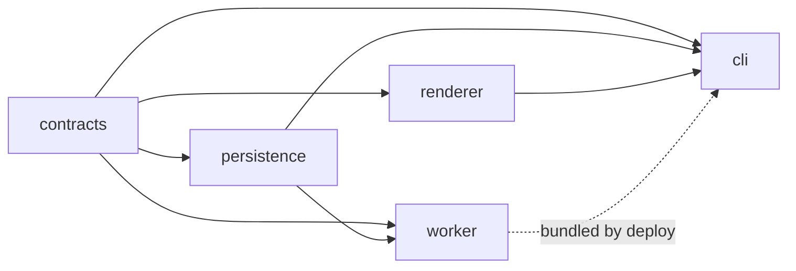

# nrdocs 2.0 Implementation Plan

## Status

This document defines the implementation sequence, repository transition, package boundaries, verification gates, and coding-agent workflow for nrdocs 2.0.

It is written for implementation with Cursor Agent against the existing `noam-r/nrdocs` repository. It is not a migration plan for the 1.x implementation and does not authorize compatibility work.

## Purpose

The plan turns the locked nrdocs 2.0 product and technical specifications into an ordered development program that:

- starts from a clean implementation inside the existing repository;
- preserves the old implementation through Git history rather than active compatibility code;
- gives a coding agent only the context required for its current phase;
- makes each phase independently reviewable and testable;
- prevents unresolved security or deployment details from being guessed; and
- ends with one installable CLI and one self-contained Cloudflare deployment.

## Authoritative Specification Set

The coding agent must treat these documents as normative.

| Document                                                                                         | Authority                                                                                                                      |
| ------------------------------------------------------------------------------------------------ | ------------------------------------------------------------------------------------------------------------------------------ |
| [`00-product-brief.md`](./00-product-brief.md)                                                   | Product definition, actors, scope, fixed feature set, and non-goals                                                            |
| [`01-user-journeys-and-lifecycle.md`](./01-user-journeys-and-lifecycle.md)                       | User-visible flows, state behavior, command outcomes, and lifecycle expectations                                               |
| [`02-cli-configuration-and-credentials.md`](./02-cli-configuration-and-credentials.md)           | Exact command surface, configuration schema, navigation behavior, local stores, credential resolution, output, and errors      |
| [`03-system-architecture.md`](./03-system-architecture.md)                                       | Component boundaries, Cloudflare model, administrative boundary, publication architecture, serving path, and failure isolation |
| [`04-data-model-and-state-invariants.md`](./04-data-model-and-state-invariants.md)               | D1 entities, state invariants, concurrency, deletion ordering, token lifecycle, and R2 artifact states                         |
| [`05-publication-api-and-artifact-lifecycle.md`](./05-publication-api-and-artifact-lifecycle.md) | HTTP contract, manifest and archive formats, server validation, atomic promotion, idempotency, and reader routes               |
| [`07-security-and-resource-limits.md`](./07-security-and-resource-limits.md)                     | Token, password, session, CSRF, abuse, lock, redaction, and numeric resource-limit contract                                    |
| [`08-cloudflare-deployment-and-operations.md`](./08-cloudflare-deployment-and-operations.md)     | Cloudflare authentication, permissions, resource identity, deployment, reconciliation, upgrades, and custom domain             |
| [`09-fixed-reader-and-serving.md`](./09-fixed-reader-and-serving.md)                             | Native reader UI, complete page schema, browser behavior, responses, caching, headers, and storage failures                    |
| This document                                                                                    | Implementation order, repository layout, engineering gates, and Cursor operating procedure                                     |

### Interpretation rules

1. A specialized specification controls its own subject. For example, the CLI document controls exact command names and the API document controls exact HTTP fields.
2. This plan may sequence or partition specified behavior, but it may not change that behavior.
3. A coding agent must not revive a 1.x concept to resolve an implementation difficulty.
4. A coding agent must not change a locked algorithm, numeric limit, Cloudflare
   policy, reader behavior, or public contract to ease implementation.
5. If two normative statements appear incompatible, implementation stops at the smallest affected unit and the conflict is presented for human resolution.

## Current Readiness and Gates

The complete 2.0 behavior is specified and ready to implement. There are no
known product-contract gaps blocking Phases 0 through 12. Phase 0A remains a
mandatory external-platform feasibility gate: it verifies that current
Cloudflare behavior satisfies the locked architecture before the active 1.x
tree is replaced. It does not authorize alternative product behavior.

The coding agent must still implement one bounded phase per reviewed task. The
existence of a complete specification does not authorize a one-shot rewrite.

### Authorized starting sequence

Use the plan as a sequence of bounded Cursor tasks, not as one “implement nrdocs 2.0” prompt:

1. Run Phase 0A alone and review its sanitized feasibility report.
2. If and only if Phase 0A passes, authorize Phase 0 repository replacement separately.
3. Implement Phases 1 through 3 one phase per reviewed task.
4. Continue one phase at a time through Phase 12, using every named normative
   document and exit gate.

Passing an earlier phase never waives a later engineering or acceptance gate.

## Repository Strategy

nrdocs 2.0 remains in the existing `nrdocs` repository. The implementation is new; the product and repository identity remain continuous.

### Required transition

1. Verify the working tree and identify every uncommitted user change.
2. Create and push an annotated tag on the last Git-coupled implementation commit, before removing any tracked 1.x source.
3. Create a short-lived `v2-bootstrap` branch from that commit.
4. Add the nrdocs 2.0 specification set to the branch.
5. Remove the 1.x implementation and 1.x specifications from the active branch after the legacy tag exists remotely.
6. Scaffold the clean 2.0 workspace.
7. Merge the bootstrap branch into `main` after the Phase 0 gate passes.
8. Use ordinary short-lived branches for subsequent phases.

Suggested legacy tag:

```text
legacy-git-coupled-final
```

The exact tag name is less important than creating an immutable remote reference before source removal.

### Active-tree rule

The 2.0 branch must not contain parallel `v1/` and `v2/` implementations. The legacy tag is the archive.

Old specifications should not remain beside current specifications under ambiguous names. Once the bootstrap is merged, the 2.0 specifications may be renamed from `nrdocs-specs/` to `specs/` in one mechanical commit, with all internal links updated together.

### Reuse policy

Starting from scratch does not mean refusing all existing code. It means that reuse requires affirmative review against the 2.0 contracts.

| Existing area                                                                                                | Default treatment                                                    | Reason                                                                               |
| ------------------------------------------------------------------------------------------------------------ | -------------------------------------------------------------------- | ------------------------------------------------------------------------------------ |
| TypeScript, pnpm, Vitest, formatting, and build patterns                                                     | May be reused after dependency refresh                               | Infrastructure patterns do not carry product behavior                                |
| Markdown parsing and renderer utilities                                                                      | Candidate for isolated extraction only after contract tests          | Some parsing work may remain valid, but configuration and output assumptions changed |
| Mermaid and syntax-highlighting bundling                                                                     | Candidate for reuse after fixed-interface review                     | The features remain, but publisher-controlled execution must remain impossible       |
| Generic MIME and safe-path utilities                                                                         | Candidate for reuse after allowlist comparison and adversarial tests | Names may match while semantics differ                                               |
| Worker upload/build packaging                                                                                | Candidate for reuse after deployment-contract review                 | Self-contained deployment remains useful, but bindings and administration changed    |
| GitHub OIDC, repository identity, repository routes, rules, approval, pending state, and workflow generation | Delete; do not adapt                                                 | These concepts do not exist in 2.0                                                   |
| Existing D1 migrations                                                                                       | Delete; do not migrate forward                                       | The 2.0 database is a clean schema with different entities and invariants            |
| Operator application tokens and profiles                                                                     | Delete                                                               | Cloudflare authority and the instance descriptor replace them                        |
| Source export and site ZIP behavior                                                                          | Delete                                                               | Source and archive downloads are explicit non-goals                                  |
| 1.x command parser and help output                                                                           | Rebuild from the 2.0 command table                                   | Removed commands must not survive as aliases or hidden options                       |

Every reused source file must have a review note in its pull request explaining which 2.0 requirement it satisfies and which new tests protect that behavior.

## Pre-Implementation Platform Gate

The current architecture deliberately has no nrdocs administrator API. Before destructive repository replacement or production scaffolding, Phase 0A must prove that the required Cloudflare control-plane paths are supportable with an acceptable administrator experience.

This gate is a disposable technical experiment, not a partial nrdocs implementation. It must not create compatibility code, production naming conventions, or credentials that become product state.

If the gate fails, stop and revise the affected architectural boundary before implementing later phases. Do not postpone the discovery to Phase 7.

## Target Workspace

The initial workspace should contain five packages and one integration-test area.

```text
packages/
  contracts/       Pure shared schemas, identifiers, protocol types, fixtures
  persistence/     Runtime-neutral D1 migrations, operations, row decoders, invariants
  renderer/        Node-side discovery, Markdown validation, rendering, packaging
  worker/          Cloudflare Worker, D1/R2 adapters, publish and serve
  cli/             Public npm package `nrdocs`; executable, administration client, and bundled deployment resources
tests/
  fixtures/        Cross-package publication and adversarial fixtures
  e2e/             CLI-to-Worker journeys using isolated local resources
nrdocs-specs/   Authoritative specification set during implementation
```

### Dependency direction



Rules:

- `contracts` has no Node-only, browser-only, Wrangler, D1, or R2 dependency.
- `persistence` owns one 2.0 migration and operation model for both administrative and Worker mutations. It imports contracts but has no network, credential-discovery, filesystem, Wrangler, or Worker-runtime dependency.
- `renderer` is local and Node-side; the Worker never imports Markdown tooling.
- `worker` imports contracts and persistence but never imports CLI or renderer code.
- `cli` imports contracts, persistence, and renderer; it orchestrates local rendering and Cloudflare administration but contains no Worker request handler.
- `worker` and `cli` provide separate execution adapters for the same parameterized persistence operations. They must not carry independent SQL, migrations, row decoders, or state-transition rules.
- `cli` is the only publishable workspace package. It packages the compiled Worker, the single persistence migration set, fixed platform assets, and deployment metadata produced by the other packages; those internal packages remain private workspace implementation details.
- The packed CLI resolves every bundled resource relative to its installed package, never from the current directory, repository root, or another installed nrdocs package.
- Shared code is moved to `contracts` only when it is genuinely runtime-neutral.
- Cross-resource orchestration such as D1-plus-R2 deletion remains in the administrator CLI; the persistence package exposes atomic metadata operations and deterministic keys but does not perform hidden remote side effects.
- New packages beyond these five require a concrete boundary that cannot be expressed inside them.

### Runtime baseline

Use [Node.js 24 LTS](https://nodejs.org/en/about/previous-releases) for development and the published CLI. The legacy repository requires Node 20, which is end-of-life and must not be carried into a new major implementation. The official 2.0 platform matrix is Node 24 on Linux and macOS. CI must test both operating systems on the pinned Node 24 line. Node 22 or Windows compatibility may be added only through an explicit later support decision; Windows additionally requires a locked credential-storage and ACL contract.

Pin the package manager through the root `packageManager` field and commit the lockfile. Exact dependency versions are selected during Phase 0 and updated deliberately, not by copying the legacy lockfile.

## Engineering Rules

### Contract-first development

Every public data boundary shared by two packages begins as a schema, type, fixture, and negative test in `contracts`. Shared durable-state behavior then uses those contracts through `persistence`; migrations and SQL operations do not move into `contracts`.

This includes:

- IDs and slug rules;
- `nrdocs.yml` schema;
- local credential and instance descriptors;
- manifest schema and canonical JSON;
- API success and error envelopes;
- publishing-target and publication responses;
- MIME and extension allowlists; and
- normalized domain errors.

Runtime validation is required at filesystem, HTTP, archive, D1-result, and Cloudflare-response boundaries. TypeScript types alone are not validation.

### Dependency injection at side-effect boundaries

Time, random ID generation, filesystem roots, environment variables, terminal interaction, HTTP, D1, R2, and Cloudflare APIs must be injectable behind narrow interfaces.

This permits deterministic tests without implementing a general framework or service container.

### No hidden state

- Commands receiving `[directory]` resolve exactly that directory or the current directory.
- No ancestor search is permitted.
- Publisher destination comes from `publish.credential` plus its exact credential source, or from an explicit admin-local bind on `publish`.
- Administrative destination comes only from `--instance` or `active-instance`.
- Publisher state never selects an administrative instance. Admin-local `publish` may use the active instance as the destination host; it still must not infer a site from the directory name.

### Secret handling

The complete secret boundary is locked in
`07-security-and-resource-limits.md`. At all times:

- publisher tokens and reader passwords never enter ordinary arguments;
- diagnostic structures classify secret fields so they cannot be serialized accidentally;
- tests use unmistakably fake secrets and assert they are absent from output;
- local publisher credential files use atomic writes and required permissions; and
- Cloudflare credentials are resolved externally and never copied into nrdocs state.

### Determinism

Navigation, routes, manifest serialization, archive order, timestamps, file modes, and digests must be deterministic. Golden fixtures must produce byte-identical canonical descriptors across repeated runs.

### Errors

Internally, use structured domain errors with:

```text
code
phase
safe_message
optional source location
optional remediation command
cause reserved for non-user diagnostics
```

Human and JSON presenters consume the same error object. No command constructs unrelated ad hoc error strings inside business logic.

### Scope control

The agent must reject or escalate any implementation that introduces:

- repository detection;
- GitHub-specific publishing behavior;
- source builds in the Worker;
- source Markdown or directory ZIP upload;
- publication history or rollback;
- arbitrary HTML, CSS, JavaScript, themes, or plugins;
- a Worker administrator API;
- nrdocs administrator accounts or tokens;
- site discovery;
- per-site domains; or
- implicit destination selection.

## Cursor Agent Operating Procedure

### One phase per Cursor task

Each implementation phase should be completed in a fresh Cursor Agent conversation or a deliberately compacted context. Do not ask one unbounded agent session to implement the entire system.

Each task supplies:

1. this plan;
2. the phase's listed authoritative documents;
3. the current repository status and relevant completed-phase handoff; and
4. an explicit instruction not to implement later phases.

### Required agent sequence

For every phase, Cursor must:

1. read every listed specification completely;
2. inspect the current code and tests relevant to the phase;
3. report any conflict, missing prerequisite, or dirty-worktree overlap before editing;
4. state the intended files, interfaces, and tests;
5. implement only the phase deliverables;
6. run the phase verification commands;
7. inspect the diff for accidental 1.x behavior, secrets, generated output, or unrelated changes; and
8. produce the required handoff report.

The agent may make ordinary local implementation decisions inside a locked boundary. It must stop for a material product, security, deployment, or public-contract decision.

### Required handoff report

Every phase ends with:

```text
Outcome
Files changed
Contracts implemented
Tests added
Commands executed and results
Remaining limitations
Specification questions or deviations
Recommended next phase
```

“No deviations” must be stated explicitly when true.

### Git behavior

- Do not commit, push, tag, publish, or deploy unless the human task explicitly authorizes it.
- Preserve unrelated user changes.
- Never use destructive reset or checkout commands to clean the tree.
- Keep generated packages, coverage, Wrangler state, credentials, and preview output out of Git.
- Prefer one reviewed commit per completed phase after human approval.

### Reusable Cursor prompt

```text
Implement Phase <N> from @nrdocs-specs/06-implementation-plan.md.

Read the phase's authoritative specifications completely before editing. Treat them
as contracts. Inspect the current repository and preserve unrelated changes.

Do not implement later phases, revive any nrdocs 1.x concept, or change a locked
contract to ease implementation. If a material contradiction is found, stop
only the affected work and explain the exact blocker with document and section.

Before editing, summarize the intended files, interfaces, tests, and acceptance
gate. After editing, run every required verification command, inspect the diff,
and provide the handoff report required by the implementation plan.
```

## Phase 0A: Disposable Cloudflare Feasibility Gate

### Goal

Prove the platform assumptions on which the no-administrator-API architecture depends before deleting or scaffolding the active repository.

### Authorization and isolation

This phase creates and deletes external Cloudflare resources. Before running it, the coding agent must obtain explicit human authorization for:

- the Cloudflare account to use;
- the disposable resource prefix;
- creation and deletion of the spike resources; and
- the intended externally configured Cloudflare authentication source.

Run the spike from a temporary directory or isolated worktree. Do not change the active nrdocs implementation, create the legacy tag, or begin Phase 0 until this gate passes.

### Authoritative documents

- [`02-cli-configuration-and-credentials.md`](./02-cli-configuration-and-credentials.md), administrative authentication and instance descriptor
- [`03-system-architecture.md`](./03-system-architecture.md), administrative path, shared persistence boundary, and feasibility gate
- [`04-data-model-and-state-invariants.md`](./04-data-model-and-state-invariants.md), atomic state and deletion ordering
- [`05-publication-api-and-artifact-lifecycle.md`](./05-publication-api-and-artifact-lifecycle.md), streaming artifact ingestion
- [`07-security-and-resource-limits.md`](./07-security-and-resource-limits.md), limits and redaction
- [`08-cloudflare-deployment-and-operations.md`](./08-cloudflare-deployment-and-operations.md), exact authentication, permissions, resources, and reconciliation

### Work

Build the smallest disposable probes necessary to verify:

1. **Deployment from any directory.** Upload a minimal Worker and create or reconcile one D1 database, one private R2 bucket, and the required bindings without a persistent deployment project.
2. **Shared atomic D1 execution.** Define one parameterized operation in the intended persistence-package representation. Execute it both through a Worker D1 binding and through the authenticated D1 control-plane API. Prove that a deliberately failing later statement rolls back the complete batch.
3. **R2 administrative deletion.** Through the specified administrator
   credential-discovery flow and R2 REST object API, create objects below one
   opaque test prefix, paginate the complete prefix, delete it, and confirm it
   is empty. Prove that the same externally resolved Cloudflare bearer token is
   sufficient and that no S3 or R2 credential is created or persisted.
4. **Streaming publication ingestion.** Upload a representative deterministic `.tar.gz` to the minimal Worker, stream-parse it without buffering the complete compressed or expanded artifact, enforce trial compressed/uncompressed/file-count limits, and write the declared objects to the private R2 bucket.
5. **Cleanup and retry.** Delete the disposable Worker, D1 database, R2 objects, and bucket. Repeat cleanup after one intentionally interrupted attempt to prove the operation is safely retryable.

The probes must use current official Cloudflare behavior. Relevant starting
points are [D1 database query](https://developers.cloudflare.com/api/resources/d1/subresources/database/methods/query/),
[Worker D1 batches](https://developers.cloudflare.com/d1/worker-api/d1-database/),
[R2 object operations](https://developers.cloudflare.com/api/resources/r2/subresources/buckets/subresources/objects/),
[Worker script upload](https://developers.cloudflare.com/api/resources/workers/subresources/scripts/methods/update/),
and [Wrangler authentication](https://developers.cloudflare.com/workers/wrangler/commands/general/).

### Evidence

Produce a short sanitized feasibility report containing:

- exact APIs and SDK entry points exercised;
- credential type and minimum permissions used for each operation;
- whether the credential source works with the CLI's “resolve externally, never persist” rule;
- request, archive, CPU, memory, and duration observations relevant to later limit selection;
- cleanup results; and
- unresolved platform constraints.

Do not include token values, access-key IDs, secret access keys, account IDs, bucket IDs, signed URLs, or other live resource identifiers in committed evidence.

### Exit gate

The phase passes only if:

- deployment and binding work from an arbitrary directory;
- the same persistence operation model can execute atomically through both D1 paths;
- R2 prefix deletion works through a documented, usable administrator credential flow without nrdocs persisting a Cloudflare or R2 credential;
- representative publication ingestion can be streamed within plausible Worker limits;
- all disposable resources are confirmed removed; and
- the sanitized report identifies no architectural blocker.

If any condition fails, stop. Revise the relevant architecture and specifications before Phase 0. In particular, do not add a hidden Worker administrator endpoint, store a long-lived R2 secret in the instance descriptor, or duplicate D1 SQL merely to make the spike pass.

## Phase 0: Preserve Legacy and Bootstrap 2.0

### Goal

Create a clean, testable 2.0 workspace while preserving the final Git-coupled implementation immutably.

### Authoritative documents

- [`00-product-brief.md`](./00-product-brief.md), especially “Clean Break from nrdocs 1.x”
- [`03-system-architecture.md`](./03-system-architecture.md), especially component boundaries, shared persistence, and non-goals
- This document's repository strategy and target workspace

### Work

1. Confirm that the Phase 0A feasibility gate passed and that its disposable resources were removed.
2. Verify the current branch, remote, head commit, status, and untracked files.
3. Obtain explicit human authorization for tag, branch, deletion, commit, and push actions.
4. Create and push the annotated legacy tag.
5. Create `v2-bootstrap`.
6. Remove legacy source, migrations, tests, root configuration, README content, and specifications from the active tree only after the tag is confirmed remotely.
7. Retain repository-level identity such as license, contribution metadata, and appropriate ignore rules.
8. Scaffold the five-package workspace and integration-test directories.
9. Set Node 24 LTS, Linux and macOS CI jobs, a pinned pnpm version, TypeScript strict mode, formatter, linter, Vitest, and coverage configuration.
10. Configure `packages/cli` as public package `nrdocs` with version `2.0.0`, one `nrdocs` binary entry, an explicit package-file allowlist, and private internal workspace packages.
11. Add root commands:

```text
pnpm build
pnpm typecheck
pnpm lint
pnpm test
pnpm test:e2e
pnpm verify
```

12. Add CI for install, format/lint, typecheck, unit tests, integration tests that need no external account, and package build.
13. Replace the README with a concise 2.0 development statement and links to the specifications. Do not document unfinished commands as available.

### Tests

- Every package can be imported from its declared public entry point.
- Only `packages/cli` is publishable, with npm identity `nrdocs` and binary name `nrdocs`; every other workspace package is marked private.
- `pnpm verify` passes from a fresh install.
- Build output is reproducible and ignored.
- A repository scan finds no active OIDC, repository approval, rules, pending-state, source-export, or generated-workflow implementation.

### Exit gate

- The legacy tag exists remotely.
- The active tree contains no 1.x product implementation.
- The specification set is committed.
- All five packages build with minimal placeholder entry points only.
- `npm pack --dry-run` for `packages/cli` identifies one package named `nrdocs`, one executable, and no accidental source, secret, cache, or legacy implementation file.
- CI is green.
- No production behavior has been invented during scaffolding.

## Phase 1: Shared Contracts and Conformance Fixtures

### Goal

Create the runtime-neutral contracts that prevent persistence, CLI, renderer, Worker, and tests from independently inventing formats.

### Authoritative documents

- [`02-cli-configuration-and-credentials.md`](./02-cli-configuration-and-credentials.md)
- [`04-data-model-and-state-invariants.md`](./04-data-model-and-state-invariants.md)
- [`05-publication-api-and-artifact-lifecycle.md`](./05-publication-api-and-artifact-lifecycle.md)
- [`09-fixed-reader-and-serving.md`](./09-fixed-reader-and-serving.md), MIME and extension contract

### Work

Implement in `packages/contracts`:

- branded or opaque types for instance, site, token-record, artifact, lock, and request IDs;
- exact slug validation, including `_nrdocs` rejection;
- the schema-version-1 portable path-collision key and shared cross-runtime fixtures;
- timestamp parsing and canonical UTC representation;
- `nrdocs.yml` runtime schemas without filesystem behavior;
- canonical BCP 47 `language` validation with the effective `und` default;
- exact `direction` validation with the effective `auto` default;
- shared title trimming, NFC normalization, control-character rejection, and 1–160 Unicode-scalar validation;
- local credential and instance-descriptor schemas;
- navigation-entry and normalized navigation-tree types;
- fixed page, asset, attachment, and forbidden extension maps;
- manifest schema version 1;
- canonical JSON serialization and artifact-digest calculation;
- publisher API request metadata and response envelopes;
- stable API error codes;
- stable CLI exit categories and publisher HTTP-to-exit mappings;
- current-publication summary types; and
- domain-error and safe-output types.

Create shared fixtures for:

- minimum valid preview configuration;
- minimum valid connected configuration;
- public and password site states;
- valid and invalid manifest packages;
- each API success response;
- each defined API error;
- identifier, slug, path, and normalization boundary cases; and
- exact, NFC, Unicode-case, and cross-collection path-collision cases.

Do not implement token verification, password hashing, session signing, or numeric limits in this phase.

### Tests

- Round-trip valid fixtures through runtime schemas.
- Reject unknown `nrdocs.yml` fields.
- Canonicalize valid language tags; reject malformed or multiple tags; and prove omitted `language` and `direction` resolve to `und` and `auto` without inspecting content or host locale.
- Normalize valid title fixtures; reject empty, control-containing, and overlong titles; and accept duplicate titles.
- Reject malformed and reserved slugs.
- Verify canonical JSON against fixed golden bytes.
- Verify artifact digest stability under repeated execution.
- Verify every domain and publisher API error fixture maps to exactly one CLI exit category.
- Reject manifest unknown fields, invalid counts, unsafe paths, and exact or portable-key collisions within and across public-path collections.
- Prove that every allowed image and attachment extension has exactly one MIME
  mapping and that allowed and forbidden extension sets are disjoint.
- Confirm contracts can run in Node and Worker-compatible test environments.

### Exit gate

- Every later package can consume one authoritative contract.
- No shared schema contains a repository, branch, commit, approval, rule, history, or rollback field.
- Golden fixtures are committed and reviewed before consumers are implemented.

## Phase 2: CLI Shell, Configuration, and Local State

### Goal

Implement the exact command surface and safe local state mechanics without performing deployment, publication, or rendering yet.

### Authoritative documents

- [`01-user-journeys-and-lifecycle.md`](./01-user-journeys-and-lifecycle.md), journeys 1–7 and 20
- [`02-cli-configuration-and-credentials.md`](./02-cli-configuration-and-credentials.md), complete document

### Work

Implement in `packages/cli`:

- the exact publisher and administrator command tree;
- `--help`, `--version`, supported `--json`, and administrative `--instance` parsing;
- exact directory resolution with no ancestor search;
- rejection of a symbolic-link publication root or `nrdocs.yml` before configuration parsing;
- `nrdocs.yml` loading and schema-error presentation;
- atomic local JSON and pointer-file writes;
- publisher credential paths and Unix permission enforcement;
- instance descriptor paths and active-instance selection;
- complete/incomplete `NRDOCS_URL` and `NRDOCS_TOKEN` resolution;
- interactive terminal, masked prompt, and confirmation abstractions for administration, plus explicit non-interactive publisher-CI detection;
- common human and JSON result presenters;
- structured remediation errors with the locked process-exit taxonomy and one centralized category mapper; and
- command handlers that fail explicitly as “not implemented” only at internal development boundaries, never in a published package.

Implement the local-only commands that require no renderer or server:

- `nrdocs credentials list`
- `nrdocs credentials remove <site-id>`
- `nrdocs instance list`
- `nrdocs instance show [instance-id]`
- `nrdocs instance use <instance-id>`

### Tests

Use an injected temporary home directory and environment for every test.

Test:

- exact directory selection;
- symbolic-link publication-root and configuration rejection;
- no upward configuration search;
- exact credential filename mapping;
- required 0700 directory and 0600 file behavior on Linux and macOS;
- atomic replacement and failure cleanup;
- rejection of symlink or unsafe credential targets;
- environment-pair completeness;
- publisher/admin destination separation;
- JSON output stability;
- exact exit-code fixtures for success, usage, local validation, credentials/authority, retryable external conditions, compatibility/protocol, local I/O, internal defects, and interruption;
- destructive-confirmation helpers;
- rejection of every administrative mutation before side effects when no interactive terminal is attached; and
- absence of every removed 1.x command and alias from help output.

### Exit gate

- The full 2.0 command tree is visible and no 1.x command is visible.
- Implemented local commands meet the CLI acceptance criteria relevant to their scope.
- Tests never read or write the developer's real home directory.
- No secret appears in snapshot output or thrown-error serialization.

## Phase 3: Navigation, Routes, and Publication Selection

### Goal

Turn a publication directory into one deterministic validated page graph and referenced-file set.

### Authoritative documents

- [`00-product-brief.md`](./00-product-brief.md), content, navigation, routes, and fixed rendering
- [`01-user-journeys-and-lifecycle.md`](./01-user-journeys-and-lifecycle.md), journeys 6–10
- [`02-cli-configuration-and-credentials.md`](./02-cli-configuration-and-credentials.md), publication configuration through Markdown validation

### Work

Implement in `packages/renderer`:

- automatic discovery for `index.md`, `NN-slug.md`, and `NN-slug/`;
- non-traversal of symbolic-link directories and explicit errors for symlinked navigation candidates;
- duplicate-prefix and nonconforming-Markdown errors;
- explicit navigation parsing and complete page allowlisting;
- nested linked and unlinked sections with root depth 1 and a maximum depth of 8;
- page-title resolution and explicit-navigation titles using the shared title contract without truncation;
- duplicate-title acceptance independent of route-collision rejection;
- deterministic route generation with ordering prefixes removed;
- route, case, and normalization collision detection;
- root-page or first-navigable-page redirect selection;
- strict UTF-8 decoding, leading-BOM handling, and CRLF/CR-to-LF parser-input normalization;
- selected-page Markdown parsing;
- local Markdown link resolution;
- referenced image and attachment collection;
- root-containment checks for every resolved path;
- rejection of selected or referenced entries with a symbolic-link entry or directory component;
- broken, escaping, unsupported, and unlisted-Markdown reference diagnostics; and
- source-location-aware diagnostics where the parser provides locations.

Implement `nrdocs generate nav [directory]`, including:

- configuration creation with required title;
- nested explicit list generation;
- `--title`, `--dry-run`, and `--force`;
- preservation of existing `publish`, `title`, `language`, and `direction` data; and
- refusal to overwrite explicit navigation without force.

### Tests

Create fixture directories for:

- valid automatic and explicit sites;
- nested sections with and without `index.md`;
- valid depth-8 trees and rejected depth-9 automatic and explicit trees;
- missing root index;
- duplicate numeric prefixes;
- route collisions;
- empty, control-containing, 160-scalar, 161-scalar, normalized, and duplicate-title cases;
- exact, NFC, and locale-independent Unicode case collisions across selected source paths, public paths, and artifact paths;
- unlisted Markdown links, including `publish --force` broken-link rendering;
- symlinked navigation candidates, selected pages, referenced files, ancestor directories, and escaping relative paths;
- valid UTF-8 with and without one leading BOM, invalid UTF-8, misplaced or repeated BOMs, and LF/CRLF/CR-equivalent sources;
- broken references;
- every allowed and forbidden extension; and
- deterministic generation across filesystem enumeration order.

Property tests should exercise safe relative-path normalization and collision behavior. The same collision fixtures must pass on Linux, macOS, and the Worker-compatible contract runtime.

### Exit gate

- One immutable normalized publication graph feeds preview and publish.
- `generate nav` produces an editable explicit configuration without touching content files.
- Unreferenced files are absent from the publication set.
- No route exposes numeric order prefixes, source extensions, or source paths.

## Phase 4: Markdown Renderer and Deterministic Artifact

### Goal

Render the normalized publication graph locally and produce the deterministic complete-document artifact described by API schema version 1.

### Authoritative documents

- [`00-product-brief.md`](./00-product-brief.md), fixed Markdown and reader interface
- [`02-cli-configuration-and-credentials.md`](./02-cli-configuration-and-credentials.md), published selection and Markdown validation
- [`03-system-architecture.md`](./03-system-architecture.md), no server-side source build
- [`05-publication-api-and-artifact-lifecycle.md`](./05-publication-api-and-artifact-lifecycle.md), artifact and manifest sections
- [`07-security-and-resource-limits.md`](./07-security-and-resource-limits.md), content and numeric limits
- [`09-fixed-reader-and-serving.md`](./09-fixed-reader-and-serving.md), exact page shell, allowlist, highlighting, and Mermaid contract

### Work

Implement in `packages/renderer`:

- CommonMark plus only GFM tables, task lists, strikethrough, and autolink literals;
- fenced code blocks and deterministic syntax-highlighting markup;
- Mermaid fence transformation into inert platform-consumable markup;
- CommonMark soft-break behavior without automatic hard-break conversion;
- rejection of raw HTML, MDX, iframe, frontmatter, footnote, math, emoji-shortcode, definition-list, component, directive, custom script, and custom style input;
- safe URL and attribute generation;
- complete slug-neutral HTML5 documents using the fixed nrdocs reader shell; page fragments and server-side shell assembly are forbidden;
- exact propagation of the manifest's effective language and direction to the `html` root's `lang` and `dir` attributes;
- route-relative links for artifact pages, assets, and attachments so a slug rename never requires artifact rewriting;
- only exact renderer-selected platform CSS and JavaScript references under `/_nrdocs/`, with no inline or publisher-selected executable content;
- previous/next and navigation data derived from the normalized graph;
- manifest version 1 construction;
- deterministic object paths;
- exact byte sizes and per-file SHA-256 digests;
- canonical descriptor and artifact digest;
- deterministic tar entry order and normalized metadata;
- gzip packaging with normalized metadata; and
- an in-memory artifact representation shared by preview and packaging.

The complete-document architecture is locked by the publication contract. The exact server-enforced element/attribute allowlist and platform-asset versions remain gated until the rest of the fixed page and serving contract is locked. Until then, generated markup must remain minimal, inert, and covered by snapshots; do not claim the server validator is complete.

### Tests

- One fixture for every supported Markdown feature.
- One rejection fixture for every unsupported feature.
- UTF-8 line-ending variants produce byte-identical rendered pages and artifact digests.
- Soft breaks, literal dollar/colon text, and unsupported-extension diagnostics match fixed fixtures.
- Golden rendered markup for navigation, headings, code, Mermaid, links, and files.
- Full-document snapshots proving one doctype/root/head/body envelope, fixed semantic regions, exact manifest-to-document language and direction propagation, route-relative artifact links, and absence of a baked site slug or hostname.
- Byte-identical manifest descriptor and digest across repeated builds.
- Archive entry, mode, timestamp, order, and path normalization.
- Exact archive-to-manifest correspondence.
- Absence of Markdown source, `nrdocs.yml`, unreferenced files, Git files, and forbidden web assets.
- External-link and local-reference URL safety.

### Exit gate

- Rendering and packaging require no network or credential.
- The Worker will not need Markdown parsing or source files.
- Every page artifact is a complete document that can be served unchanged after validation.
- The artifact contains only rendered pages and referenced allowed files.
- Deterministic fixtures pass on every supported Node platform in CI.
- The fixed-page validator gap remains clearly tracked and blocks production publication.

## Phase 5: Local Preview

### Goal

Provide the complete local publisher feedback loop before any server dependency is required.

### Authoritative documents

- [`01-user-journeys-and-lifecycle.md`](./01-user-journeys-and-lifecycle.md), journey 7
- [`02-cli-configuration-and-credentials.md`](./02-cli-configuration-and-credentials.md), `nrdocs preview`
- [`03-system-architecture.md`](./03-system-architecture.md), preview responsibilities
- [`07-security-and-resource-limits.md`](./07-security-and-resource-limits.md), local precheck limits
- [`09-fixed-reader-and-serving.md`](./09-fixed-reader-and-serving.md), exact reader behavior used by preview

### Work

Implement `nrdocs preview [directory]`:

- load and validate the exact directory configuration;
- reuse the Phase 3 and 4 pipeline without forks;
- serve the in-memory or temporary artifact on loopback only;
- reproduce production-relative routes and root redirect behavior;
- serve only manifest-declared pages and files;
- print counts and the local URL;
- shut down cleanly on termination; and
- remove any temporary data.

Do not add browser launch, watch mode, live reload, persistent output, credential resolution, or publication behavior.

### Tests

- Preview works without `publish.credential`.
- Preview fails before binding a port when validation fails.
- Root and nested routes match the normalized route graph.
- Previewed pages preserve the manifest's effective `lang` and `dir` values, including the `und` and `auto` defaults.
- Referenced files have the expected content type and disposition.
- Unknown paths return 404.
- No external HTTP request occurs.
- No durable output remains after shutdown.

### Exit gate

- A publisher can create navigation and preview a complete local minisite.
- Preview and artifact generation use the same renderer and manifest.
- The local happy path is usable before Cloudflare work begins.

## Phase 6: Shared Data and Storage Foundation

### Goal

Implement the clean shared D1 model, its CLI and Worker adapters, and the R2 state abstractions without yet exposing production publish or password endpoints.

### Authoritative documents

- [`03-system-architecture.md`](./03-system-architecture.md), D1, R2, durability, and failure isolation
- [`04-data-model-and-state-invariants.md`](./04-data-model-and-state-invariants.md), complete document
- [`05-publication-api-and-artifact-lifecycle.md`](./05-publication-api-and-artifact-lifecycle.md), artifact lifecycle and failure semantics

### Work

Implement in `packages/persistence`:

- a new migration baseline containing only 2.0 tables and constraints;
- typed parameterized operations and validated row decoders;
- the one-row instance metadata invariant;
- normalized instance display-name storage and descriptor-consistency validation;
- site and publishing-token operations;
- exact empty/current-publication tuple invariants;
- current-publication language and direction metadata for fixed pre-artifact access pages;
- access-mode and password-verifier consistency constraints;
- session-generation transitions;
- per-site lock acquisition, ownership, renewal seam, expiration, and release;
- conditional promotion requiring site, token, and lock validity;
- deterministic private R2 keys using opaque site and artifact IDs; and
- transaction-oriented site-deletion metadata primitives.

Implement in `packages/worker` and `packages/cli`:

- separate D1 execution adapters for the same persistence operations;
- Worker-bound and administrator-control-plane conformance tests against shared fixtures; and
- adapter-specific error normalization without duplicating SQL or domain transitions.

Implement the R2 state abstractions behind Worker and administrator adapters:

- staging/current/orphan artifact operations;
- best-effort cleanup interfaces; and
- prefix-list/delete behavior required by retryable site deletion.

No migration imports or transforms a 1.x table. Schema migration tracking begins at the 2.0 baseline.

### Tests

Use a real SQLite-compatible test path for SQL invariants and a fake/in-memory R2 adapter for storage state. Run the same persistence conformance suite against both D1 execution adapters where the environment permits; adapter fixtures must prove identical parameter binding, row decoding, and atomic-operation semantics.

Test:

- all site-state combinations;
- access/password constraints;
- current-publication tuple all-null/all-present behavior;
- canonical current language and exact `ltr`, `rtl`, or `auto` direction constraints;
- token-name uniqueness per site;
- cascade deletion;
- two competing lock acquisitions;
- stale-lock reclaim;
- wrong-owner release and promotion rejection;
- token revocation racing promotion;
- complete promotion and unchanged-digest behavior;
- failure before promotion preserving the old pointer; and
- orphan cleanup never deleting the current prefix.

### Exit gate

- The database can represent only valid 2.0 product states.
- One conditional operation makes an artifact current.
- No prior artifact pointer or publication-history entity exists.
- Persistence tests prove the delete-versus-publish race is closed.
- CLI and Worker adapters consume one migration and operation source; a repository scan finds no second SQL implementation.

## Phase 7: Cloudflare Deployment and Instance Administration

### Goal

Make `nrdocs deploy` self-contained and implement explicit local instance selection.

### Engineering gate

Do not start production implementation until Phase 0A has passed. Production
policy is already locked by the deployment specification; the spike verifies
that the current Cloudflare platform can implement it.

### Authoritative documents

- [`01-user-journeys-and-lifecycle.md`](./01-user-journeys-and-lifecycle.md), journeys 1 and 2
- [`02-cli-configuration-and-credentials.md`](./02-cli-configuration-and-credentials.md), instance store and administrative authentication
- [`03-system-architecture.md`](./03-system-architecture.md), administrative architecture
- [`07-security-and-resource-limits.md`](./07-security-and-resource-limits.md), secret generation and deployment bindings
- [`08-cloudflare-deployment-and-operations.md`](./08-cloudflare-deployment-and-operations.md), complete deployment and operations contract
- the reviewed Phase 0A feasibility report

### Work

- Bundle the Worker and migrations into the published CLI.
- Implement a narrow Cloudflare control-plane client.
- Resolve supported Cloudflare authority without storing it.
- Provision or safely reconcile the Worker, D1 database, private R2 bucket, bindings, and optional one canonical hostname.
- Apply only 2.x schema migrations.
- Create and atomically store the non-secret instance descriptor.
- Store the normalized display name in D1 and the descriptor while retaining the opaque instance ID as the only target key.
- Select the deployed instance as active.
- Verify descriptor instance identity before every mutation.
- Implement idempotent retry and precise partial-deployment reporting.
- Create no project, `wrangler.toml`, repository, or persistent deployment directory in the invocation directory.

Use the exact REST/API-token and bundled-Wrangler OAuth paths specified in the
deployment contract. Do not generate a deployment project or create S3-style
R2 credentials.

### Tests

- Contract tests for every Cloudflare response parser.
- Recorded safe fixtures for success, already-exists, permission denied, rate limited, partial failure, and malformed response.
- Deploy from an unrelated empty directory and assert it remains unchanged.
- Repeated deploy reconciles the same instance instead of creating a second one.
- Instance descriptor contains no credential.
- Instance list/show output includes the display name and opaque ID; name-based selection is rejected.
- `--instance` overrides only one command and does not rewrite the active pointer.

### Exit gate

- Deploy works without a deployment repository.
- The Worker has D1 and private R2 bindings.
- The descriptor is sufficient for every later administrative command.
- A least-privilege permission list is documented and tested.
- No Worker administrator mutation endpoint exists.

## Phase 8: Site, Token, and Access Administration

### Goal

Implement the complete Cloudflare-authenticated administrative CLI against the direct control-plane boundary.

### Authoritative documents

- [`01-user-journeys-and-lifecycle.md`](./01-user-journeys-and-lifecycle.md), journeys 3, 4, and 14–19
- [`02-cli-configuration-and-credentials.md`](./02-cli-configuration-and-credentials.md), site and token command semantics
- [`03-system-architecture.md`](./03-system-architecture.md), administrative path and deletion
- [`04-data-model-and-state-invariants.md`](./04-data-model-and-state-invariants.md), all state transitions
- [`07-security-and-resource-limits.md`](./07-security-and-resource-limits.md), token and password security contract
- [`08-cloudflare-deployment-and-operations.md`](./08-cloudflare-deployment-and-operations.md), direct D1/R2 administration and deletion

### Work

Implement:

- `site create`, including atomic site, access state, and initial named token creation;
- `site list` and `site show`;
- `site access <slug> public|password`;
- `site password change`;
- `site enable` and `site disable`;
- `site rename` with no alias or redirect;
- `site delete` with exact-slug confirmation and race-safe storage deletion;
- `token issue`, `token list`, and `token revoke`;
- exact `--ttl` parsing, security-limit enforcement, and expiry calculation from authoritative D1 transaction time into canonical UTC RFC 3339;
- masked password prompts and one-time token output; and
- stable JSON output for read commands and one-time terminal-only issuance output.

Administrative commands mutate D1 and R2 through Cloudflare authority. They never call a Worker administrator route and never accept a publisher token.

### Tests

- Each lifecycle transition and prohibited transition.
- Public/password verifier invariants.
- Session-generation increments on required operations only.
- Initial token atomicity.
- Named-token uniqueness, valid and invalid TTL grammar, boundary limits, authoritative D1-time calculation, canonical UTC storage, and irreversible revocation.
- Rename preserving site ID, content pointer, password, and tokens.
- Disable preserving publication ability and policy.
- Delete first disabling and revoking tokens, then excluding in-flight promotion, deleting R2, and deleting D1.
- Failure during R2 deletion leaves a safely disabled retryable site with revoked tokens.
- Every administrative mutation rejects non-interactive input, `--yes`, and `--json` before any D1, R2, or Cloudflare mutation.
- No human or JSON output leaks password, token verifier, or previously issued token.

### Exit gate

- An administrator can create a usable publication target and control its complete lifecycle.
- Publisher and reader authority remain unable to invoke these operations.
- Every destructive outcome and confirmation matches the user journeys.

## Phase 9: Publisher API and Atomic Publication

### Goal

Implement the two authenticated publisher endpoints and complete server-side artifact validation and promotion.

### Authoritative documents

- [`03-system-architecture.md`](./03-system-architecture.md), publication and failure isolation
- [`04-data-model-and-state-invariants.md`](./04-data-model-and-state-invariants.md), token authentication, locks, promotion, and artifact state
- [`05-publication-api-and-artifact-lifecycle.md`](./05-publication-api-and-artifact-lifecycle.md), complete publisher protocol
- [`07-security-and-resource-limits.md`](./07-security-and-resource-limits.md), authentication, limits, locks, abuse, and redaction
- [`09-fixed-reader-and-serving.md`](./09-fixed-reader-and-serving.md), exact stored-page validator

### Work

Implement:

- `GET /_nrdocs/api/v1/publish-target`;
- optional expected-site assertion only for first connection;
- `POST /_nrdocs/api/v1/publish` with required headers and media type;
- token resolution to exactly one site;
- generic unusable-token response and explicit site-mismatch response;
- compressed, expanded, per-file, count, path, duration, and concurrency limits;
- streaming or bounded archive ingestion;
- safe tar entry validation;
- manifest schema, canonical digest, and exact file correspondence validation;
- manifest site/page title normalization and length validation;
- fixed rendered-page schema validation, including manifest-to-document language and direction equality;
- isolated R2 staging;
- per-site lock acquisition;
- conditional token-and-lock-checked promotion;
- unchanged-digest idempotency;
- lock release and safe orphan cleanup; and
- request IDs and safe error envelopes.

### Tests

- Every documented HTTP success and error code.
- First-connect target resolution with no expected ID.
- Expected-ID mismatch revealing no metadata about the expected site.
- Revoked, expired, malformed, unknown, and deleted-site token behavior.
- Disabled-site publication success.
- Archive traversal, link entries, exact duplicates, portable-key collisions, undeclared files, missing files, digest mismatch, expansion abuse, and page-schema violations.
- Concurrent publish conflict.
- Interrupted upload and validation failure preserving current content.
- Promotion failure preserving current content.
- Ambiguous client retry returning `unchanged` when promotion already committed.
- No response exposing R2 keys, artifact IDs, history, or secrets.

### Exit gate

- A valid completed artifact can replace one site's current content atomically.
- A malformed, unsafe, interrupted, unauthorized, or conflicting request cannot alter current content.
- No source build or arbitrary-site upload path exists.

## Phase 10: Connect and Publish CLI

### Goal

Complete the publisher happy path for local use and provider-neutral CI.

### Authoritative documents

- [`00-product-brief.md`](./00-product-brief.md), primary publisher promise
- [`01-user-journeys-and-lifecycle.md`](./01-user-journeys-and-lifecycle.md), journeys 5 and 8–11
- [`02-cli-configuration-and-credentials.md`](./02-cli-configuration-and-credentials.md), credential resolution, `connect`, and `publish`
- [`05-publication-api-and-artifact-lifecycle.md`](./05-publication-api-and-artifact-lifecycle.md), publisher endpoints and CLI relationship
- [`07-security-and-resource-limits.md`](./07-security-and-resource-limits.md), publisher-token validation and local resource prechecks

### Work

Implement `nrdocs connect [directory]`:

- deterministic selection between masked interactive input and complete `NRDOCS_URL`/`NRDOCS_TOKEN` environment input;
- `--title` for a missing title in non-interactive mode, with idempotent normalized-equality handling and no implicit title edits;
- server URL normalization;
- first-connect target resolution;
- interactive existing-pointer mismatch confirmation and environment-mode mismatch rejection without a bypass flag;
- title prompt only when absent;
- atomic protected credential-file write only in interactive mode;
- explicit non-persistence and non-mutation of local credential files in environment-backed mode;
- minimally invasive `nrdocs.yml` create/update; and
- clear next steps.

Implement `nrdocs publish [directory] [--force]`:

- exact configuration and credential resolution order (environment pair, local token file, then admin-local D1/R2);
- complete environment-pair override without persistence and without falling through to admin bind;
- admin-local first bind (0/1/N sites) that writes `nrdocs.yml` and does not store a publisher token;
- `--instance` allowed on `publish` for the admin path only;
- publish-target preflight before rendering on the HTTP path;
- token/site equality check on the HTTP path;
- reuse of the Phase 3 and 4 pipeline;
- `--force` to publish with broken page links rendered as struck-through reader markup;
- pre-upload counts;
- artifact upload with required headers, or admin-local staging/promotion;
- `published` and `unchanged` results;
- disabled-site success explanation; and
- stage-specific failure output stating that live content was unchanged.

### Tests

- Interactive first connect writes consistent configuration and protected credential state only after successful validation.
- Environment-backed first connect writes only the safe configuration pointer, default navigation when needed, and supplied missing title; it never writes a credential file.
- Missing or incomplete environment input and a missing non-interactive title fail without prompting or writing.
- Existing same-site interactive reconnect replaces the local token without changing the pointer.
- Existing same-site environment connect leaves any local credential file untouched.
- Different-site interactive reconnect requires explicit confirmation; environment-backed reconnect fails without writing.
- Partial write failure does not leave inconsistent local state.
- Local and environment credential resolution follow the exact algorithm.
- Admin-local unbound publish with 0, 1, or N sites binds without a Server or token prompt and does not write a credential file.
- Bound `nrdocs.yml` with an admin session and no credential file publishes without `connect`.
- Bound `nrdocs.yml` with no admin session and no credential file instructs the operator to run `connect`.
- A complete `NRDOCS_URL`/`NRDOCS_TOKEN` pair wins over an admin session.
- CI mode makes no filesystem credential write and uses no Git metadata.
- Site mismatch aborts before rendering or upload.
- Local validation failure makes no publish request.
- Upload response and network-failure messages preserve secret redaction.
- Every publisher API error and transport failure maps to the specified stable process exit code without parsing response prose.
- End-to-end local and CI publication produce the same artifact digest.

### Exit gate

- The documented admin `deploy → publish` happy path works from a plain directory with no Git.
- The documented remote `connect → preview → publish` happy path works from a plain directory with no Git.
- Subsequent publication needs only `nrdocs publish`.
- Generic CI needs only `NRDOCS_URL`, `NRDOCS_TOKEN`, the directory, and `nrdocs.yml`.
- No destination is guessed from a directory name.

## Phase 11: Reader Serving and Password Access

### Goal

Serve only the current publication through the fixed interface under public or site-scoped password access.

### Authoritative documents

- [`00-product-brief.md`](./00-product-brief.md), reader access, URLs, and fixed interface
- [`01-user-journeys-and-lifecycle.md`](./01-user-journeys-and-lifecycle.md), journeys 12, 13, and 21
- [`03-system-architecture.md`](./03-system-architecture.md), reader architecture and caching boundary
- [`04-data-model-and-state-invariants.md`](./04-data-model-and-state-invariants.md), access and session-generation invariants
- [`05-publication-api-and-artifact-lifecycle.md`](./05-publication-api-and-artifact-lifecycle.md), reader route contract
- [`07-security-and-resource-limits.md`](./07-security-and-resource-limits.md), password, session, CSRF, and abuse contract
- [`09-fixed-reader-and-serving.md`](./09-fixed-reader-and-serving.md), exact UI and serving contract

### Work

Implement:

- generic non-listing `GET /`;
- reserved `/_nrdocs/` platform assets and access routes;
- root-level slug lookup;
- identical 404 behavior for unknown, deleted, disabled, and empty sites where required;
- public current-artifact serving;
- root-page or first-page redirect;
- canonical trailing-slash page behavior;
- manifest-only page, inline asset, and attachment resolution;
- safe MIME and attachment headers;
- password form and safe return-location handling;
- current-publication language and direction on password-entry and other site-scoped fixed access pages before artifact serving;
- password verification and site-scoped signed session;
- session-generation validation;
- logout;
- fixed response and cache headers; and
- controlled behavior for D1/R2 inconsistency without fallback to stale content.

### Tests

- Full content/lifecycle/access matrix.
- Public access without cookies.
- Protected deep-link return after password entry.
- Explicit and default language/direction values on published pages and fixed password-access pages.
- One site's session failing on another site, including equal passwords.
- Password change and removal invalidating existing sessions.
- Disable and delete taking effect under any permitted cache.
- Rename invalidating the old route without redirect while preserving site identity.
- Unknown manifest path and arbitrary R2 key access returning 404.
- Attachment disposition and inline MIME handling.
- Return-location, cookie, CSRF, brute-force, header-injection, and path-normalization adversarial cases.
- No source Markdown, archive, R2 URL, site listing, or administrator link exposure.

### Exit gate

- Readers can access exactly one current artifact under the site's current policy.
- Access to one site never grants access to another.
- Policy changes require no artifact rebuild.
- Old or orphaned artifact prefixes are unreachable.

## Phase 12: Integrated Verification, Packaging, and Release

### Goal

Prove the complete product against the specifications and release an installable nrdocs 2.0 candidate.

### Authoritative documents

- All documents in the authoritative specification set

### Work

1. Build an acceptance traceability matrix from every numbered acceptance criterion to automated tests.
2. Run the complete user journeys against a disposable Cloudflare test instance.
3. Verify self-contained deployment from an empty directory.
4. Verify local publication from a non-Git directory.
5. Verify provider-neutral publication from a generic CI container with no Git metadata.
6. Test `npm pack`, then install only that tarball in a clean temporary environment outside the repository and verify executable startup, Worker bundle inclusion, the single migration source, fixed platform assets, and deployment metadata without workspace resolution.
7. Test the packed CLI on Linux and macOS using the pinned Node 24 line, including credential permission enforcement and unsupported-Windows startup rejection.
8. Perform dependency, license, secret, and bundle-content review.
9. Perform the dedicated security review after functional behavior is locked.
10. Replace development README content with truthful installation, administration, publishing, CI, reader-access, troubleshooting, and limitations documentation.
11. Remove transitional names such as `nrdocs-specs` if the specifications are now the only active version.
12. Produce a release candidate before `v2.0.0`.

### Required end-to-end journeys

- Deploy instance.
- Select between two instances.
- Create public and password sites.
- Generate navigation without a token.
- Preview without a token.
- Connect and first-publish from a plain local directory.
- Republish changed and unchanged content.
- Fail publication at local validation, upload, server validation, and promotion boundaries.
- Publish from CI environment credentials.
- Read public and protected deep links.
- Change and remove passwords.
- Issue, expire, revoke, and replace publisher tokens.
- Disable, publish while disabled, and enable.
- Rename without an old-route redirect.
- Permanently delete and verify stale local pointers fail.
- Visit the generic instance root without discovering sites.

### Exit gate

- Every acceptance criterion has at least one automated test and a recorded passing result.
- `pnpm verify` passes from a clean checkout.
- The packed CLI performs deploy, administration, preview, connect, and publish without repository-local runtime dependencies.
- The installed package never downloads or selects a separate nrdocs Worker, renderer, migration, or platform-assets version at runtime.
- No 1.x command, API, schema, route, migration, or compatibility behavior remains.
- Security and deployment reviews have no unresolved release blocker.
- The release is tagged `v2.0.0` only after the release candidate passes the disposable-instance suite.

## Test Architecture

### Unit tests

Unit tests cover pure contracts, canonicalization, navigation, route generation, link selection, renderer transforms, error presentation, and state-transition decisions.

### Property tests

Property tests target path normalization, slug validation, archive entry normalization, route collisions, manifest canonicalization, and state-transition concurrency assumptions.

### Contract tests

The same JSON and artifact fixtures are consumed by CLI and Worker tests. A change to a shared public contract must update the schema, fixture, producer test, consumer test, and specification together.

### Integration tests

Integration tests use:

- real filesystem semantics inside isolated temporary roots;
- SQLite/D1-compatible execution for migrations and conditional queries;
- a Worker-compatible runtime for request handling;
- an R2 adapter that can inject partial writes and failures; and
- a fake Cloudflare control-plane server for deterministic CLI behavior.

Mocks must preserve the transaction and conditional-update semantics on which correctness depends.

### End-to-end tests

Two suites are required:

1. A local deterministic suite with no external account, run on every pull request.
2. A disposable Cloudflare suite, run on protected release candidates or an explicitly authorized workflow.

The disposable suite must use uniquely scoped resources and perform bounded cleanup. It must never target an existing user instance.

### Snapshot policy

Snapshots are appropriate for:

- CLI help;
- human errors and success output;
- stable JSON output;
- rendered safe-page structure; and
- generic reader pages.

Snapshots do not replace semantic assertions for secrets, permissions, database transitions, manifests, or response headers.

## Verification Commands

The root `pnpm verify` command must eventually perform, in a stable order:

```text
format check
lint
typecheck
unit and property tests
contract tests
local integration tests
build
package-content verification
```

Cloudflare end-to-end tests are separate because they require credentials and create external resources. They must be opt-in and unmistakably named.

No phase is complete when its relevant test command is skipped, silently allowed to fail, or replaced with a placeholder script.

## Acceptance Traceability

| Specification                                  | Primary implementation phases         |
| ---------------------------------------------- | ------------------------------------- |
| Product purpose, scope, and non-goals          | 0A, 0, and all phase reviews          |
| Administrator and publisher journeys           | 2, 7, 8, and 10                       |
| Reader journeys and lifecycle                  | 8 and 11                              |
| Configuration, navigation, and credentials     | 1 through 5 and 10                    |
| Component and authority boundaries             | 0A, 0, 6 through 9, and 11            |
| Cloudflare control-plane feasibility           | 0A, then production policy in 7 and 8 |
| D1 state invariants and concurrency            | 6, 8, and 9                           |
| Artifact and API contract                      | 1, 4, 9, and 10                       |
| Security, limits, sessions, and abuse controls | 1, 4, 8, 9, and 11                    |
| Deployment, reconciliation, and custom domain  | 0A, 7, 8, and 12                      |
| Fixed reader UI, page schema, and HTTP serving | 4, 5, 9, and 11                       |
| Full product acceptance criteria               | 12                                    |

Each pull request must cite the exact specification sections and acceptance criteria it implements. Phase 12 converts those citations into one final matrix; it must not discover major untested requirements for the first time.

## Pull Request Review Checklist

Every implementation pull request should answer:

- Which specification sections are implemented?
- Which behavior is intentionally deferred to a named later phase?
- Does the change introduce any new public command, field, route, state, or configuration option?
- Does the change contain any repository, provider, version-history, or arbitrary-hosting assumption?
- Are all filesystem, HTTP, archive, database, and Cloudflare inputs runtime-validated?
- Are destination selection and authority explicit?
- Can any error or log expose a secret?
- Can a failure partially mutate durable state?
- Are concurrency and retry behavior tested where relevant?
- Are negative and adversarial cases included?
- Did `pnpm verify` pass?
- Are there specification deviations? If yes, was the specification changed and approved first?

## Global Definition of Done

nrdocs 2.0 is ready for release only when:

1. The active repository contains one 2.0 implementation and no active 1.x compatibility layer.
2. `nrdocs deploy` provisions an instance from any directory without creating a deployment project.
3. Cloudflare authority is the only administrator authority.
4. An administrator can create and manage independent sites and tokens.
5. A publisher can connect, preview, and publish a plain Markdown directory without Git.
6. Generic CI uses the same URL-and-token contract as local publication.
7. The local and server validators enforce the fixed content and artifact contract.
8. Successful publication atomically replaces one current artifact.
9. Failed, interrupted, unauthorized, or conflicting publication leaves current content unchanged.
10. Public and password-protected reader paths work under site-scoped access.
11. Disablement, access change, rename, token revocation, password change, and deletion preserve every specified invariant.
12. No publication history, rollback, source export, repository identity, site discovery, or arbitrary web hosting is present.
13. All security, deployment, resource-limit, cache, and serving decisions are locked and tested.
14. Every numbered acceptance criterion is traceable to passing tests.
15. The packed CLI and bundled Worker pass the disposable-instance release suite.

## Post-2.0 phase: AI-agent access

After the 2.0 publication and reader contract, new artifacts use schema version 2.
The renderer emits HTML plus a stored normalized Markdown tree under `agent/`. The
Worker still serves schema v1 artifacts for humans and returns non-disclosing 404
for agent routes until the site is republished. The current CLI requires
`artifact_schema_versions` to include `2`. Readers copy Share-with-LLM
instructions; password sites mint HMAC grants with `NRDOCS_SESSION_KEY`. Grants
are not persisted in D1. Agent IDs are 32 lowercase hex digits from SHA-256 of
NFC UTF-8 of the canonical route or path.
